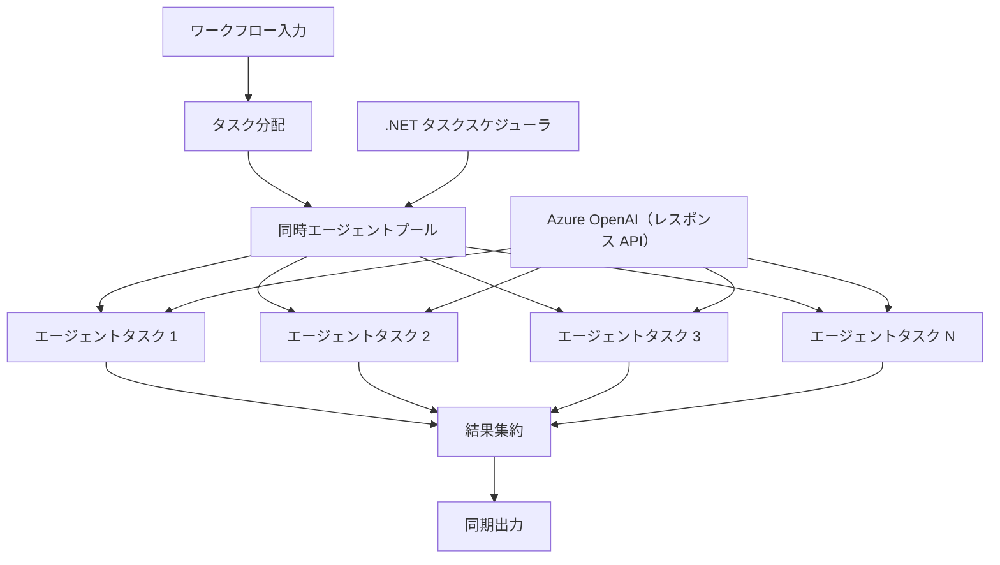

# ⚡ Azure OpenAI（Responses API）を使った同時エージェントワークフロー（.NET）

## 📋 高性能並行処理チュートリアル

このノートブックでは、Microsoft Agent Framework for .NET と Azure OpenAI（Responses API）を使用した<strong>同時実行ワークフローパターン</strong>を示します。複数のAIエージェントを同時に実行しながら調整とデータ整合性を維持し、スループットを最大化する高性能並行処理ワークフローの構築方法を学びます。

## 🎯 学習目標

### 🚀 <strong>同時処理の基礎</strong>
- <strong>並列エージェント実行</strong>: 複数のAIエージェントを同時に実行して最大性能を発揮
- **Async/Awaitパターン**: .NETの非同期プログラミングモデルを利用した効率的な同時実行
- **Azure OpenAI（Responses API）**: Azure OpenAI Responses APIへの複数同時呼び出しを調整
- <strong>リソース管理</strong>: 同時実行操作全体でのAIモデルリソースの効率的管理

### 🏗️ <strong>高度な同時実行アーキテクチャ</strong>
- <strong>タスクベースの並列処理</strong>: 最適な同時実行に .NET Task Parallel Library を活用
- <strong>同期パターン</strong>: レースコンディションを回避しつつエージェント調整
- <strong>ロードバランシング</strong>: 利用可能な並行処理能力に効率的に作業を配分
- <strong>フォールトトレランス</strong>: ワークフロー全体を停止させずに個別エージェントの障害を処理

### 🏢 <strong>エンタープライズ向け同時実行アプリケーション</strong>
- <strong>大量ドキュメント処理</strong>: 複数のドキュメントを同時処理
- <strong>リアルタイムコンテンツ分析</strong>: 入力データストリームの同時分析
- <strong>バッチ処理の最適化</strong>: 大規模データ処理オペレーションのスループット最大化
- <strong>マルチモーダル分析</strong>: 異なるコンテンツタイプやフォーマットの並行処理

## ⚙️ 前提条件とセットアップ

### 📦 **必須NuGetパッケージ**

高性能並行ワークフローに必須のパッケージ：

```xml
<!-- Core AI Framework with Async Support -->
<PackageReference Include="Microsoft.Extensions.AI" Version="10.*" />

<!-- Azure OpenAI (Responses API) -->
<PackageReference Include="Azure.AI.OpenAI" Version="2.*" />

<!-- Azure Identity and Async LINQ for Advanced Operations -->
<PackageReference Include="Azure.Identity" Version="1.15.0" />
<PackageReference Include="System.Linq.Async" Version="6.0.3" />

<!-- Local Agent Framework References -->
<!-- Microsoft.Agents.AI.dll - Core agent abstractions with async support -->
<!-- Microsoft.Agents.AI.OpenAI.dll - Azure OpenAI (Responses API) integration with concurrency -->
```

### 🔑 **Azure OpenAI 設定**

**環境設定（.envファイル）：**
```env
AZURE_OPENAI_ENDPOINT=https://<your-resource>.openai.azure.com
AZURE_OPENAI_DEPLOYMENT=gpt-5-mini
```

**同時処理の考慮事項：**
```csharp
// Configure for concurrent operations
var clientOptions = new AzureOpenAIClientOptions()
{
    // Configure network timeout for concurrent requests
    NetworkTimeout = TimeSpan.FromMinutes(5)
};
```

### 🏗️ <strong>同時実行ワークフローのアーキテクチャ</strong>



**主要構成要素：**
- **Task Parallel Library**: .NETの同時実行操作向け組み込みサポート
- <strong>エージェントプール</strong>: 並列処理のための複数エージェントのインスタンス
- <strong>結果集約</strong>: 同時実行エージェントの結果を調整し統合
- <strong>同期ポイント</strong>: 並行操作間のデータ整合性を保証

## 🎨 <strong>同時実行ワークフローデザインパターン</strong>

### 🔍 **並列リサーチ＆分析**
```
Research Topic → Concurrent Research Agents → Result Synthesis → Final Report
```

### 📊 <strong>マルチソースデータ処理</strong>
```
Data Sources → Parallel Processing Agents → Data Integration → Unified Output
```

### 🎭 <strong>コンテンツ生成パイプライン</strong>
```
Content Requirements → Concurrent Content Generators → Quality Review → Final Content
```

### 🔄 **ファンアウト／ファンイン処理**
```
Single Input → Multiple Concurrent Processors → Result Aggregation → Single Output
```

## 🏢 <strong>エンタープライズの性能メリット</strong>

### ⚡ <strong>スループットとスケーラビリティ</strong>
- <strong>線形性能スケーリング</strong>: より多くの同時エージェント追加でスループット増加
- <strong>リソース利用</strong>: 利用可能なAIモデル容量の最大効率化
- <strong>処理時間短縮</strong>: 並列実行により大幅な時間短縮
- <strong>弾性的スケーリング</strong>: ワークロードに応じて同時エージェント数を動的調整

### 🛡️ <strong>信頼性と復元力</strong>
- <strong>障害分離</strong>: 個別エージェントの失敗が他の操作に影響しない
- <strong>グレースフルデグレード</strong>: エージェント容量が減ってもシステムの継続動作
- <strong>エラー復旧</strong>: 失敗した同時操作に対する自動リトライ機構
- <strong>負荷分散</strong>: 利用可能なエージェント間で作業を均等分配

### 📊 <strong>パフォーマンスモニタリング</strong>
- <strong>同時実行メトリクス</strong>: すべての並列操作の性能追跡
- <strong>リソース使用分析</strong>: CPU、メモリ、ネットワーク利用状況を監視
- <strong>スループット分析</strong>: 同時処理による効率向上を測定
- <strong>ボトルネック検出</strong>: 性能制約を特定し解決

### 🔧 <strong>開発と運用</strong>
- <strong>非同期プログラミングモデル</strong>: .NETの成熟したasync/awaitパターンを活用
- <strong>タスク調整</strong>: 組み込みのタスク管理と調整機能
- <strong>例外処理</strong>: 同時操作向け包括的なエラー処理
- <strong>デバッグサポート</strong>: Visual Studioの同時ワークフローデバッグツール

.NETで高性能の同時実行AIワークフローを構築しましょう！🚀

## 💻 コードの実行

完全な実装は `03.dotnet-agent-framework-workflow-ghmodel-concurrent.cs` にあります。このファイルは旅行計画における<strong>ファンアウト／ファンイン同時ワークフロー</strong>を示します：

### 🏗️ <strong>ワークフローアーキテクチャ</strong>

```
User Request → ConcurrentStartExecutor → [Researcher Agent || Planner Agent] → ConcurrentAggregationExecutor → Final Output
```

**主要構成要素：**

1. **ConcurrentStartExecutor**: ユーザーリクエストを全てのエージェントに同時送信
2. **Researcher Agent**: 目的地や観光スポットを同時に分析
3. **Planner Agent**: 詳細な旅行プランを同時に作成
4. **ConcurrentAggregationExecutor**: 両エージェントの結果を収集し統合

### 🎯 **ファンアウト／ファンインパターン**

このワークフローは典型的な<strong>ファンアウト／ファンイン</strong>パターンを示します：
- <strong>ファンアウト</strong>: 1つの入力メッセージを複数エージェントに同時送信
- <strong>同時処理</strong>: 複数エージェントが同一タスクに並行して作業
- <strong>ファンイン</strong>: 全エージェントの結果を収集し単一の出力に統合

### 🚀 実例の実行

```bash
# スクリプトを実行可能にする（Unix/Linux/macOS）
chmod +x 03.dotnet-agent-framework-workflow-ghmodel-concurrent.cs

# 並行ワークフローを実行する
./03.dotnet-agent-framework-workflow-ghmodel-concurrent.cs
```

Windows上では：
```powershell
dotnet run 03.dotnet-agent-framework-workflow-ghmodel-concurrent.cs
```

### 📝 期待される出力

ワークフローは以下を行います：
1. <strong>リクエスト送信</strong>: 「12月にシアトルへの旅行を計画する」を両エージェントに送信
2. <strong>同時処理</strong>: 両エージェントが同時に作業：
   - Researcherは観光スポットと詳細を特定
   - Plannerは旅程と物流を作成
3. <strong>集約</strong>: 両方の応答を総合的な出力に統合
4. <strong>結果表示</strong>: すべての情報を含む統合旅行プランを表示

### 🔧 カスタマイズオプション

**同時エージェントを増やす：**
```csharp
// Create additional specialized agents
AIAgent budgetAgent = azureClient.GetChatClient(deployment).AsAIAgent(
    name: "Budget-Agent", instructions: "Calculate travel costs...");

// Add to fan-out
var workflow = new WorkflowBuilder(startExecutor)
    .AddFanOutEdge(startExecutor, targets: [researcherAgent, plannerAgent, budgetAgent])
    .AddFanInBarrierEdge(sources: [researcherAgent, plannerAgent, budgetAgent], target: aggregationExecutor)
    .WithOutputFrom(aggregationExecutor)
    .Build();

// Update aggregation count
if (this._messages.Count == 3) { ... }
```

**エージェント指示を変更：**
```csharp
const string ResearcherAgentInstructions = "Your custom instructions for research...";
const string PlanAgentInstructions = "Your custom instructions for planning...";
```

**タスクを変更：**
```csharp
StreamingRun run = await InProcessExecution.RunStreamingAsync(
    workflow, 
    "Plan a European vacation for 2 weeks in summer"
);
```

### 🎯 実際の応用例

この同時パターンは以下に最適です：
- <strong>コンテンツ作成</strong>: 複数作家が異なるセクションを同時に作成
- <strong>コードレビュー</strong>: 複数レビュアーが異なる視点でコード解析
- <strong>市場調査</strong>: 異なる市場セグメントの並行分析
- <strong>ドキュメント処理</strong>: 同時に抽出、分析、検証
- <strong>多角的分析</strong>: 同一入力に対する多様な視点の取得

### 🔍 カスタムエグゼキューターの理解

**ConcurrentStartExecutor:**
- `IMessageHandler<string>` を実装し文字列入力を受け取る
- 接続されたすべてのエージェントにメッセージを送信
- 同時処理を開始するために `TurnToken` を送信

**ConcurrentAggregationExecutor:**
- `IMessageHandler<ChatMessage>` を実装しエージェントの応答を受信
- スレッドセーフにメッセージを収集
- 期待する全応答到着時に集約
- `context.YieldOutputAsync()` を使って最終出力を生成

### ⚡ 性能メリット

**同時処理 vs 逐次処理：**
- 逐次処理: Agent1 (30秒) → Agent2 (30秒) = **合計60秒**
- 同時処理: Agent1 (30秒) || Agent2 (30秒) = **合計30秒**

<strong>スループット向上</strong>: N個の同時エージェントで最大N倍高速化（ワークロードとリソース依存）

### 🛡️ エラー処理

ワークフローは個別エージェントの障害を優雅に処理します：
- 1つのエージェントに障害があっても他は処理を継続
- 集約器はタイムアウトロジックを実装可能
- 必要に応じて部分結果を返却可能

### 📊 先進機能

**動的エージェント数：**
集約ロジックを修正して可変エージェント数に対応：

```csharp
private int _expectedAgentCount;
private readonly List<ChatMessage> _messages = [];

public override ValueTask HandleAsync(ChatMessage message, IWorkflowContext context, CancellationToken cancellationToken = default)
{
    this._messages.Add(message);
    if (this._messages.Count == _expectedAgentCount)
    {
        // Process aggregation
    }
    
    return ValueTask.CompletedTask;
}
```

この同時ワークフローパターンは、高性能でスケーラブルなAIエージェントシステム構築に不可欠です！

---

<!-- CO-OP TRANSLATOR DISCLAIMER START -->
**免責事項**：
本書類は AI 翻訳サービス [Co-op Translator](https://github.com/Azure/co-op-translator) を使用して翻訳されています。正確性を期していますが、自動翻訳には誤りや不正確な部分が含まれる可能性があることをご承知おきください。原文の原語版が正式な情報源とみなされるべきです。重要な情報については、専門の人間による翻訳を推奨します。本翻訳の利用により生じたいかなる誤解や解釈違いについても、当方は責任を負いかねます。
<!-- CO-OP TRANSLATOR DISCLAIMER END -->