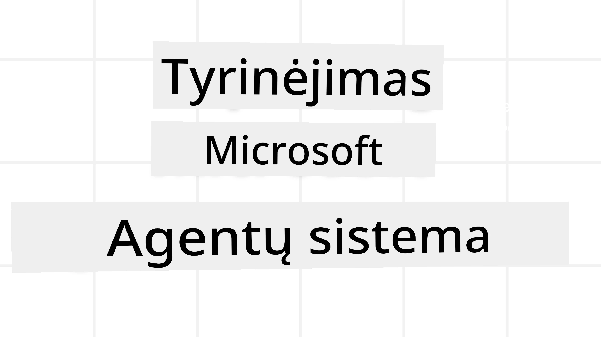
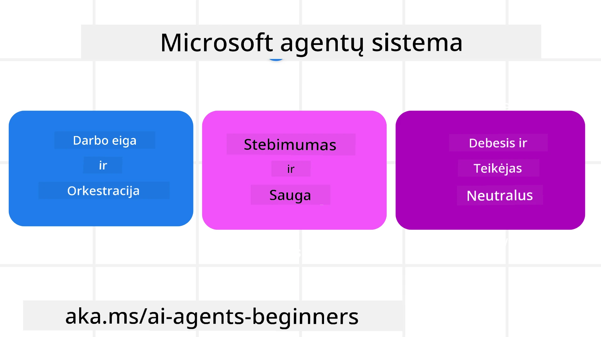

# Microsoft Agent Framework tyrinėjimas



### Įvadas

Ši pamoka apims:

- Microsoft Agent Framework supratimą: pagrindines savybes ir naudą  
- Pagrindinių Microsoft Agent Framework koncepcijų tyrinėjimą
- Išplėstinius MAF modelius: darbo eigas, tarpinę programinę įrangą ir atmintį

## Mokymosi tikslai

Baigę šią pamoką, sužinosite, kaip:

- Kurti gamybai paruoštus AI agentus, naudojant Microsoft Agent Framework
- Taikyti pagrindines Microsoft Agent Framework savybes jūsų agentinėms naudojimo sritims
- Naudoti pažangius modelius, įskaitant darbo eigas, tarpinę programinę įrangą ir stebimumą

## Kodo pavyzdžiai 

[Microsoft Agent Framework (MAF)](https://aka.ms/ai-agents-beginners/agent-framework) kodo pavyzdžius rasite šiame saugykloje `xx-python-agent-framework` ir `xx-dotnet-agent-framework` failuose.

## Microsoft Agent Framework supratimas



[Microsoft Agent Framework (MAF)](https://aka.ms/ai-agents-beginners/agent-framework) yra Microsoft vieningas AI agentų kūrimo rėmėjas. Jis suteikia lankstumą spręsti įvairius agentinių naudojimo atvejus, pastebimus tiek gamybos, tiek mokslinių tyrimų aplinkose, įskaitant:

- **Sekvinės agentų orkestracijos** scenarijuose, kai reikalingos žingsnis po žingsnio darbo eigos.
- **Konkuruojančios orkestracijos** scenarijuose, kai agentai turi užbaigti užduotis tuo pačiu metu.
- **Grupinės pokalbių orkestracijos** scenarijuose, kai agentai gali bendradarbiauti vienoje užduotyje.
- **Paveldėjimo orkestracijos** scenarijuose, kai agentai perduoda užduotį vienas kitam, kai dalinės užduotys baigiamos.
- **Magnetinės orkestracijos** scenarijuose, kai valdymo agentas kuria ir modifikuoja užduočių sąrašą bei koordinuoja padagentus užduočiai atlikti.

Siekiant pateikti AI Agentus gamyboje, MAF taip pat yra įtraukęs savybes:

- **Stebimumą** naudojant OpenTelemetry, kur stebimas kiekvienas AI agento veiksmas, įskaitant įrankių iškvietimą, orkestracijos žingsnius, mąstymo eigas ir rezultatų stebėjimą per Microsoft Foundry informacinius skydus.
- **Saugumą** talpinant agentus tiesiogiai Microsoft Foundry, kuris apima saugumo kontrolės mechanizmus, tokius kaip vaidmenų pagrindu pagrįstas prieigos valdymas, privačių duomenų tvarkymas ir integruota turinio sauga.
- **Patvarumą** - Agentų gijos ir darbo eigos gali sustoti, atnaujinti ir atsigauti po klaidų, leidžiant ilgesnes vykdymo sesijas.
- **Valdymą** - palaikomi žmogaus įsikišimo darbo eigos, kai užduotys žymimos kaip reikalaujančios žmogaus patvirtinimo.

Microsoft Agent Framework taip pat siekia būti suderinamas:

- **Debesų platformų nepriklausomu** - agentai gali veikti konteineriuose, lokaliai ir per kelias debesų platformas.
- **Paslaugų teikėjų nepriklausomu** - agentai gali būti kuriami naudojant jūsų pasirinktas SDK, įskaitant Azure OpenAI ir OpenAI.
- **Atvirų standartų integracija** - agentai gali naudoti protokolus, tokius kaip Agent-to-Agent (A2A) ir Model Context Protocol (MCP), kad rasti ir naudoti kitus agentus bei įrankius.
- **Plug-in'ai ir jungtys** - jungtys gali būti sudaromos su duomenų ir atminties paslaugomis, tokiomis kaip Microsoft Fabric, SharePoint, Pinecone ir Qdrant.

Pažiūrėkime, kaip šios savybės taikomos kai kurioms pagrindinėms Microsoft Agent Framework koncepcijoms.

## Pagrindinės Microsoft Agent Framework koncepcijos

### Agentai


**Agentų kūrimas**

Agentų kūrimas vyksta apibrėžiant išvedimo (LLM tiekėjo) tarnybą,
instrukcijų rinkinį, kurio AI agentas turi laikytis, ir priskiriant jam `name`:

```python
agent = AzureOpenAIChatClient(credential=AzureCliCredential()).create_agent( instructions="You are good at recommending trips to customers based on their preferences.", name="TripRecommender" )
```

Aukščiau naudojama `Azure OpenAI`, bet agentai gali būti kuriami naudojant įvairias paslaugas, įskaitant `Microsoft Foundry Agent Service`:

```python
AzureAIAgentClient(async_credential=credential).create_agent( name="HelperAgent", instructions="You are a helpful assistant." ) as agent
```

OpenAI `Responses`, `ChatCompletion` API

```python
agent = OpenAIResponsesClient().create_agent( name="WeatherBot", instructions="You are a helpful weather assistant.", )
```

```python
agent = OpenAIChatClient().create_agent( name="HelpfulAssistant", instructions="You are a helpful assistant.", )
```

arba [MiniMax](https://platform.minimaxi.com/), kuris suteikia OpenAI suderinamą API su didelėmis konteksto sritimis (iki 204K žetonų):

```python
agent = OpenAIChatClient(base_url="https://api.minimax.io/v1", api_key=os.environ["MINIMAX_API_KEY"], model_id="MiniMax-M3").create_agent( name="HelpfulAssistant", instructions="You are a helpful assistant.", )
```

arba nuotolinius agentus, naudojant A2A protokolą:

```python
agent = A2AAgent( name=agent_card.name, description=agent_card.description, agent_card=agent_card, url="https://your-a2a-agent-host" )
```

**Agentų vykdymas**

Agentai vykdomi naudojant `.run` arba `.run_stream` metodus, skirtingai pagal tai, ar reikalingas transliacijos režimas.

```python
result = await agent.run("What are good places to visit in Amsterdam?")
print(result.text)
```

```python
async for update in agent.run_stream("What are the good places to visit in Amsterdam?"):
    if update.text:
        print(update.text, end="", flush=True)

```

Kiekvienam agento vykdymui taip pat galima priskirti parinktis koreguoti parametrus, tokius kaip `max_tokens`, kuriuos naudoja agentas, `tools` – įrankius, kuriuos agentas gali iškviesti, ir netgi pats `model` naudojamas agentui.

Tai naudinga, kai tam tikri modeliai ar įrankiai yra reikalingi užduočiai atlikti.

**Įrankiai**

Įrankiai gali būti apibrėžiami tiek kuriant agentą:

```python
def get_attractions( location: Annotated[str, Field(description="The location to get the top tourist attractions for")], ) -> str: """Get the top tourist attractions for a given location.""" return f"The top attractions for {location} are." 


# Kai tiesiogiai kuriamas ChatAgent

agent = ChatAgent( chat_client=OpenAIChatClient(), instructions="You are a helpful assistant", tools=[get_attractions]

```

ir taip pat vykdant agentą:

```python

result1 = await agent.run( "What's the best place to visit in Seattle?", tools=[get_attractions] # Įrankis pateiktas tik šiam vykdymui )
```

**Agentų gijos**

Agentų gijos naudojamos kelių posėdžių pokalbiams. Gijos gali būti sukuriamos:

- Naudojant `get_new_thread()`, leidžiantį išsaugoti giją laikui bėgant
- Automatiškai sukuriant giją vykdant agentą, kur gija gyvuoja tik vykdymo metu.

Gijos kūrimo pavyzdys:

```python
# Sukurti naują giją.
thread = agent.get_new_thread() # Vykdyti agentą su gija.
response = await agent.run("Hello, I am here to help you book travel. Where would you like to go?", thread=thread)

```

Giją galima serializuoti ir išsaugoti vėlesniam naudojimui:

```python
# Sukurti naują giją.
thread = agent.get_new_thread() 

# Vykdyti agentą su gija.

response = await agent.run("Hello, how are you?", thread=thread) 

# Seriarizuoti giją saugojimui.

serialized_thread = await thread.serialize() 

# Deserializuoti gijos būseną po įkėlimo iš saugyklos.

resumed_thread = await agent.deserialize_thread(serialized_thread)
```

**Agentų tarpinė programinė įranga (Middleware)**

Agentai sąveikauja su įrankiais ir LLM, kad atliktų vartotojo užduotis. Kai kuriais atvejais norime vykdyti arba stebėti veiksmus tarp šių sąveikų. Agentų middleware leidžia tai daryti:

*Funkcinė middleware*

Ši middleware leidžia vykdyti veiksmą tarp agento ir funkcijos/įrankio, kurį jis iškvies. Pavyzdys – funkcijos iškvietimo žurnalo vedimas.

Toliau pateiktame kode `next` nurodo, ar turi būti iškviesta kita middleware, ar tikroji funkcija.

```python
async def logging_function_middleware(
    context: FunctionInvocationContext,
    next: Callable[[FunctionInvocationContext], Awaitable[None]],
) -> None:
    """Function middleware that logs function execution."""
    # Išankstinis apdorojimas: Įrašymas prieš funkcijos vykdymą
    print(f"[Function] Calling {context.function.name}")

    # Tęsti prie kito tarpinio programinio sluoksnio arba funkcijos vykdymo
    await next(context)

    # Poapdorojimas: Įrašymas po funkcijos vykdymo
    print(f"[Function] {context.function.name} completed")
```

*Pokalbių middleware*

Ši middleware leidžia vykdyti ar žurnaluoti veiksmą tarp agento ir užklausų LLM.

Čia pateikiama svarbi informacija, tokia kaip `messages`, siunčiami į AI paslaugą.

```python
async def logging_chat_middleware(
    context: ChatContext,
    next: Callable[[ChatContext], Awaitable[None]],
) -> None:
    """Chat middleware that logs AI interactions."""
    # Išankstinis apdorojimas: įrašas prieš AI iškvietimą
    print(f"[Chat] Sending {len(context.messages)} messages to AI")

    # Tęsti prie kito tarpinio programinės įrangos sluoksnio arba AI paslaugos
    await next(context)

    # Pasapdorojimas: įrašas po AI atsakymo
    print("[Chat] AI response received")

```

**Agentų atmintis**

Kaip aptarta pamokoje `Agentinė atmintis`, atmintis yra svarbus elementas, leidžiantis agentui veikti įvairiuose kontekstuose. MAF siūlo kelias atminties rūšis:

*Vidinė atmintis*

Tai atmintis, saugoma gijose per programos vykdymą.

```python
# Sukurkite naują giją.
thread = agent.get_new_thread() # Paleiskite agentą su gija.
response = await agent.run("Hello, I am here to help you book travel. Where would you like to go?", thread=thread)
```

*Nuolatinės žinutės*

Ši atmintis naudojama saugoti pokalbių istorijai per skirtingas sesijas. Ji apibrėžiama naudojant `chat_message_store_factory`:

```python
from agent_framework import ChatMessageStore

# Sukurti pasirinktinių žinučių saugyklą
def create_message_store():
    return ChatMessageStore()

agent = ChatAgent(
    chat_client=OpenAIChatClient(),
    instructions="You are a Travel assistant.",
    chat_message_store_factory=create_message_store
)

```

*Dinaminė atmintis*

Ši atmintis pridedama į kontekstą prieš vykdant agentus. Ji gali būti saugoma išorinėse paslaugose, tokiuose kaip mem0:

```python
from agent_framework.mem0 import Mem0Provider

# Naudojama Mem0 pažangioms atminties funkcijoms
memory_provider = Mem0Provider(
    api_key="your-mem0-api-key",
    user_id="user_123",
    application_id="my_app"
)

agent = ChatAgent(
    chat_client=OpenAIChatClient(),
    instructions="You are a helpful assistant with memory.",
    context_providers=memory_provider
)

```

**Agentų stebimumas**

Stebimumas svarbus kuriant patikimas ir prižiūrimas agentines sistemas. MAF integruojasi su OpenTelemetry, teikdamas trasavimą ir matuoklius geresniam stebimumui.

```python
from agent_framework.observability import get_tracer, get_meter

tracer = get_tracer()
meter = get_meter()
with tracer.start_as_current_span("my_custom_span"):
    # daryti kažką
    pass
counter = meter.create_counter("my_custom_counter")
counter.add(1, {"key": "value"})
```

### Darbo eigos

MAF siūlo darbo eigas, kurios yra iš anksto apibrėžti žingsniai užduočiai užbaigti ir apima AI agentus kaip šių žingsnių komponentus.

Darbo eigos sudaromos iš skirtingų komponentų, leidžiančių geriau valdyti srautą. Darbo eigos taip pat leidžia **daugiagentų orkestraciją** ir **kontrolinius taškus**, kad būtų galima išsaugoti darbo eigų būsenas.

Pagrindiniai darbo eigos komponentai yra:

**Vykdytojai**

Vykdytojai gauna įėjimo žinutes, atlieka priskirtas užduotis ir tada sukuria išėjimo žinutę. Tai varo darbo eigą link didesnės užduoties užbaigimo. Vykdytojai gali būti AI agentai arba vartotojo logika.

**Sąsajos**

Sąsajos naudojamos apibrėžti pranešimų srautą darbo eigoje. Jos gali būti:

*Tiesioginės sąsajos* – paprasti vienas prie vieno ryšiai tarp vykdytojų:

```python
from agent_framework import WorkflowBuilder

builder = WorkflowBuilder()
builder.add_edge(source_executor, target_executor)
builder.set_start_executor(source_executor)
workflow = builder.build()
```

*Sąlyginės sąsajos* – suaktyvinamos, kai įvykdoma tam tikra sąlyga. Pavyzdžiui, kai viešbučių kambariai negalimi, vykdytojas gali pasiūlyti kitus variantus.

*Perjungimo sąsajos* – pranešimų nukreipimas į skirtingus vykdytojus pagal apibrėžtas sąlygas. Pavyzdžiui, jei kelionės klientas turi prioritetinį prieigą, jų užduotys bus tvarkomos per kitą darbo eigą.

*Išskirstymo sąsajos* – viena žinutė siunčiama keliems tikslams.

*Sujungimo sąsajos* – surenka kelias žinutes iš skirtingų vykdytojų ir siunčia vienam tikslui.

**Įvykiai**

Geresniam darbo eigų stebimumui, MAF siūlo vidinius vykdymo įvykius, įskaitant:

- `WorkflowStartedEvent`  - Pradėtas darbo eigos vykdymas
- `WorkflowOutputEvent` - Darbo eiga pateikia išeitį
- `WorkflowErrorEvent` - Darbo eiga susiduria su klaida
- `ExecutorInvokeEvent`  - Vykdytojas pradeda apdorojimą
- `ExecutorCompleteEvent`  -  Vykdytojas baigia apdorojimą
- `RequestInfoEvent` - Išduodama užklausa

## Išplėstiniai MAF modeliai

Aukščiau aptartos pagrindinės Microsoft Agent Framework koncepcijos. Kuriant sudėtingesnius agentus, verta apsvarstyti šiuos pažangius modelius:

- **Tarpinės programinės įrangos (middleware) kompozicija**: sujungti kelis middleware tvarkytojus (įrašymą, autentifikavimą, greičio ribojimą), naudojant funkcijų ir pokalbių middleware, siekiant tiksliai valdyti agento elgesį.
- **Darbo eigų kontroliniai taškai**: naudoti darbo eigų įvykius ir serializaciją, kad išsaugotumėte ir pratęstumėte ilgalaikius agentų procesus.
- **Dinaminis įrankių pasirinkimas**: derinti RAG pagal įrankių aprašymus su MAF įrankių registracija, kad būtų rodomi tik aktualūs įrankiai pagal užklausą.
- **Daugiagentų užduočių perdavimas**: naudoti darbo eigų sąsajas ir sąlyginius maršrutus orkestruoti užduočių perėmimus tarp specializuotų agentų.

## LangChain / LangGraph agentų talpinimas Microsoft Foundry aplinkoje

Microsoft Agent Framework yra **rėmo tarpusavyje suderinamas** – nesate apriboti agentais, parašytais tik su MAF. Jei jau turite agentą, sukurtą su **LangChain** arba **LangGraph**, galite jį paleisti kaip **Microsoft Foundry talpinamą agentą**, kad Foundry valdymas užtikrintų vykdymo laiką, sesijas, mastelį, tapatybę ir protokolo galinius taškus, o jūsų agento logika lieka LangGraph.

Tai daroma naudojant `langchain_azure_ai.agents.hosting` paketą, kuris atveria kompiliuotą LangGraph grafinį vaizdą per tuos pačius protokolus, kuriuos naudoja Foundry talpinami agentai.

**1. Įdiekite hosting papildinį:**

```bash
pip install -U "langchain-azure-ai[hosting]>=1.2.4" azure-identity
```

`hosting` papildinys įdiegia Foundry protokolo bibliotekas: `azure-ai-agentserver-responses` (OpenAI suderinamas `/responses` galinis taškas) ir `azure-ai-agentserver-invocations` (bendras `/invocations` galinis taškas).

**2. Pasirinkite hosting protokolą:**

| Protokolas | Host klasė | Galinis taškas | Naudojimas |
|----------|-----------|----------|----------|
| **Responses** | `ResponsesHostServer` | `/responses` | Norite OpenAI suderinamo pokalbių, transliacijos, atsakymų istorijos ir pokalbių gijų palaikymo – tai rekomenduojamas numatytasis variantas pokalbių agentams. |
| **Invocations** | `InvocationsHostServer` | `/invocations` | Reikia tinkintos JSON struktūros, webhook tipo galinio taško arba ne pokalbių apdorojimo. |

Kadangi **Responses API yra pagrindinė agentų stiliaus kūrimo sąsaja Foundry**, daugumai agentų pradėkite nuo `ResponsesHostServer`.

**3. Sujunkite aplinkos kintamuosius** (`az login` pirmiausia, kad `DefaultAzureCredential` galėtų autentifikuotis):

```bash
export FOUNDRY_PROJECT_ENDPOINT="https://<resource>.services.ai.azure.com/api/projects/<project>"
export FOUNDRY_MODEL_NAME="gpt-5-mini"
```

Vėliau, kai agentas bus paleistas kaip talpinamas Foundry agentas, platforma automatiškai įves `FOUNDRY_PROJECT_ENDPOINT` kintamąjį.

**4. Atverkite LangGraph agentą per Responses protokolą:**

```python
import os

from azure.ai.projects import AIProjectClient
from azure.identity import DefaultAzureCredential, get_bearer_token_provider
from langchain.agents import create_agent
from langchain_openai import ChatOpenAI
from langchain_azure_ai.agents.hosting import ResponsesHostServer

_AZURE_AI_SCOPE = "https://ai.azure.com/.default"


def build_chat_model() -> ChatOpenAI:
    project_endpoint = os.environ["FOUNDRY_PROJECT_ENDPOINT"].rstrip("/")
    deployment = os.environ.get("FOUNDRY_MODEL_NAME", "gpt-5-mini")
    credential = DefaultAzureCredential()
    project = AIProjectClient(endpoint=project_endpoint, credential=credential)
    openai_client = project.get_openai_client()
    token_provider = get_bearer_token_provider(credential, _AZURE_AI_SCOPE)

    # Čia ChatOpenAI nukreipia į Foundry projekto OpenAI suderinamą (Atsakymai) galinį tašką.
    return ChatOpenAI(
        model=deployment,
        base_url=str(openai_client.base_url),
        api_key=token_provider,
    )


def main() -> None:
    graph = create_agent(build_chat_model(), tools=[])
    port = int(os.environ.get("PORT", "8088"))
    ResponsesHostServer(graph).run(port=port)


if __name__ == "__main__":
    main()
```

Paleiskite lokaliai su `python main.py`, tada siųskite Responses užklausą adresu `http://localhost:8088/responses`.

**Pagrindiniai elgesio bruožai:**

- **Pokalbiai**: klientai tęsia pokalbį perduodami `previous_response_id` arba `conversation` ID. Jei jūsų grafas sukompiliuotas su LangGraph kontrolės tašku, Foundry pririša pokalbio būseną prie kontrolinio taško (rekomenduojama naudoti patvaresnį kontrolės tašką gamyboje; `MemorySaver` tinka vietiniam testavimui).
- **Žmogus grandinėje**: jei jūsų grafas naudoja LangGraph `interrupt()`, `ResponsesHostServer` pateikia laukiančią pertraukimą kaip Responses `function_call` / `mcp_approval_request` objektą, o klientai tęsia su atitinkamu `function_call_output` / `mcp_approval_response`.
- **Diegimas Foundry**: naudokite Azure Developer CLI – `azd ext install azure.ai.agents`, `azd ai agent init -m <manifest>`, `azd ai agent run` (vietinis, reikia Docker), tada `azd provision` ir `azd deploy`. Talpinamo agento diegimui reikalinga **Foundry Project Manager** rolė.

Veikiantis šio pavyzdžio variantas yra [code-samples/14-langchain-hosted-agent.py](../../../14-microsoft-agent-framework/code-samples/14-langchain-hosted-agent.py) faile. Visam apėjimui (Invocations protokolas, tinkinti užklausų šablonai ir trikčių šalinimas) žr. [Host LangGraph agents as Foundry hosted agents](https://learn.microsoft.com/azure/foundry/how-to/develop/langchain-hosted-agents).

## Kodo pavyzdžiai 

Microsoft Agent Framework kodo pavyzdžius rasite šiame saugykloje `xx-python-agent-framework` ir `xx-dotnet-agent-framework` failuose.

## Turite daugiau klausimų apie Microsoft Agent Framework?

Prisijunkite prie [Microsoft Foundry Discord](https://discord.com/invite/ATgtXmAS5D), kad susitiktumėte su kitais besimokančiais, dalyvautumėte konsultacijose ir gautumėte atsakymus į savo AI agentų klausimus.
## Ankstesnė pamoka

[Atmintis AI agentams](../13-agent-memory/README.md)

## Kitas pamoka

[Kompiuterio naudojimo agentų kūrimas (CUA)](../15-browser-use/README.md)

---

<!-- CO-OP TRANSLATOR DISCLAIMER START -->
**Atsakomybės apribojimas**:
Šis dokumentas buvo išverstas naudojant dirbtinio intelekto vertimo paslaugą [Co-op Translator](https://github.com/Azure/co-op-translator). Nors siekiame tikslumo, prašome atkreipti dėmesį, kad automatiniai vertimai gali turėti klaidų ar netikslumų. Originalus dokumentas jo gimtąja kalba laikomas autoritetingu šaltiniu. Svarbiai informacijai rekomenduojama naudoti profesionalų žmogiškąjį vertimą. Mes neatsakome už jokius nesusipratimus ar neteisingą interpretaciją, kilusią naudojantis šiuo vertimu.
<!-- CO-OP TRANSLATOR DISCLAIMER END -->