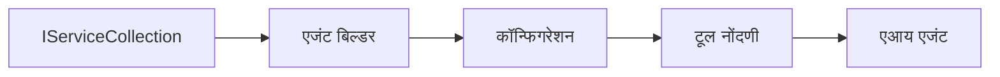

# 🎨 Azure OpenAI (Responses API) सह Agentic डिझाइन पॅटर्न (.NET)

## 📋 शिकण्याची उद्दिष्टे

हा उदाहरण स्मार्ट एजंट तयार करण्यासाठी Microsoft Agent Framework वापरून Azure OpenAI (Responses API) सह .NET मध्ये एंटरप्राइझ-ग्रेड डिझाइन पॅटर्न दाखवतो. तुम्ही व्यावसायिक पॅटर्न आणि आर्किटेक्चरल दृष्टिकोन शिकाल जे एजंट्सना उत्पादनासाठी तयार, देखभाल-योग्य आणि प्रमाणवृद्ध करणारे बनवतात.

### एंटरप्राइझ डिझाइन पॅटर्न

- 🏭 **Factory Pattern**: अवलंबित्व इंजेक्शनसह प्रमाणित एजंट निर्मिती
- 🔧 **Builder Pattern**: प्रवाही एजंट कॉन्फिगरेशन आणि सेटअप
- 🧵 **Thread-Safe Patterns**: समवर्ती संभाषण व्यवस्थापन
- 📋 **Repository Pattern**: नियोजित साधन आणि क्षमता व्यवस्थापन

## 🎯 .NET-विशिष्ट आर्किटेक्चरल फायदे

### एंटरप्राइझ वैशिष्ट्ये

- **Strong Typing**: कम्पाईल-टाईम प्रमाणीकरण आणि IntelliSense समर्थन
- **Dependency Injection**: बिल्ट-इन DI कंटेनर एकत्रीकरण
- **Configuration Management**: IConfiguration आणि Options पॅटर्न
- **Async/Await**: first-class असिंक्रोनस प्रोग्रामिंग समर्थन

### उत्पादनासाठी तयार पॅटर्न

- **Logging Integration**: ILogger आणि संरचित लॉगिंग समर्थन
- **Health Checks**: बिल्ट-इन मॉनिटरिंग आणि निदान
- **Configuration Validation**: डेटा अ‍ॅनोटेशन्ससह मजबूत टायपिंग
- **Error Handling**: संरचित अपवाद व्यवस्थापन

## 🔧 तांत्रिक आर्किटेक्चर

### मुख्य .NET घटक

- **Microsoft.Extensions.AI**: एकत्रित AI सेवा सार
- **Microsoft.Agents.AI**: एंटरप्राइझ एजंट ऑर्केस्ट्रेशन फ्रेमवर्क
- **Azure OpenAI (Responses API)**: उच्च-कार्यक्षमता API क्लायंट पॅटर्न
- **Configuration System**: appsettings.json आणि पर्यावरण एकत्रीकरण

### डिझाइन पॅटर्न अंमलबजावणी



## 🏗️ दाखवलेले एंटरप्राइझ पॅटर्न

### 1. **निर्मिती पॅटर्न**

- **Agent Factory**: सुसंगत कॉन्फिगरेशनसह केंद्रीकृत एजंट निर्मिती
- **Builder Pattern**: जटिल एजंट कॉन्फिगरेशनसाठी प्रवाही API
- **Singleton Pattern**: सामायिक संसाधने आणि कॉन्फिगरेशन व्यवस्थापन
- **Dependency Injection**: सैल coupling आणि चाचणी सुलभता

### 2. **व्यवहाराचे पॅटर्न**

- **Strategy Pattern**: बदलण्याजोग्या साधन अंमलबजावणी रणनीती
- **Command Pattern**: पूर्ववत/पुन्हा करण्याजोग्या एन्कॅप्स्युलेट केलेले एजंट ऑपरेशन्स
- **Observer Pattern**: घटना-चालित एजंट जीवनचक्र व्यवस्थापन
- **Template Method**: प्रमाणित एजंट अंमलबजावणी कार्यप्रवाह

### 3. **सांरचनात्मक पॅटर्न**

- **Adapter Pattern**: Azure OpenAI (Responses API) एकत्रीकरण स्तर
- **Decorator Pattern**: एजंट क्षमतामध्ये वाढ
- **Facade Pattern**: सोपी एजंट संवाद इंटरफेस
- **Proxy Pattern**: कार्यक्षमता साठी लेझी लोडिंग आणि कॅशिंग

## 📚 .NET डिझाइन तत्त्वे

### SOLID तत्त्वे

- **Single Responsibility**: प्रत्येक घटकाला एक स्पष्ट उद्दिष्ट
- **Open/Closed**: सुधारणा न करता विस्तारशील
- **Liskov Substitution**: इंटरफेस-आधारित साधन अंमलबजावण्या
- **Interface Segregation**: लक्ष केंद्रित, सुसंगत इंटरफेस
- **Dependency Inversion**: ठोस गोष्टींपेक्षा सारांवर अवलंबित्व

### स्वच्छ आर्किटेक्चर

- **Domain Layer**: मुख्य एजंट आणि साधन सार
- **Application Layer**: एजंट ऑर्केस्ट्रेशन आणि कार्यप्रवाह
- **Infrastructure Layer**: Azure OpenAI (Responses API) एकत्रीकरण आणि बाह्य सेवा
- **Presentation Layer**: वापरकर्ता संवाद आणि प्रतिक्रिया स्वरूपन

## 🔒 एंटरप्राइझ विचार

### सुरक्षा

- **Credential Management**: IConfiguration सह सुरक्षित API की हाताळणी
- **Input Validation**: मजबूत टायपिंग आणि डेटा अ‍ॅनोटेशन प्रमाणीकरण
- **Output Sanitization**: सुरक्षित प्रतिसाद प्रक्रिया आणि फिल्टरिंग
- **Audit Logging**: सर्वसमावेशक ऑपरेशन ट्रॅकिंग

### कामगिरी

- **Async Patterns**: नॉन-ब्लॉकिंग I/O ऑपरेशन्स
- **Connection Pooling**: कार्यक्षम HTTP क्लायंट व्यवस्थापन
- **Caching**: सुधारलेल्या कामगिरीसाठी प्रतिसाद कॅशिंग
- **Resource Management**: योग्य निष्पादन आणि साफसफाई पॅटर्न

### प्रमाणवृद्धी

- **Thread Safety**: समवर्ती एजंट अंमलबजावणी समर्थन
- **Resource Pooling**: कार्यक्षम संसाधन वापर
- **Load Management**: दर मर्यादा आणि मागील दाब हाताळणी
- **Monitoring**: कामगिरी मेट्रिक्स आणि हेल्थ चेक्स

## 🚀 उत्पादनात तैनात करणे

- **Configuration Management**: पर्यावरण-विशिष्ट सेटिंग्ज
- **Logging Strategy**: सहसंवाद ID सह संरचित लॉगिंग
- **Error Handling**: योग्य पुनर्प्राप्तीसह जागतिक अपवाद हाताळणी
- **Monitoring**: अनुप्रयोग अंतर्दृष्टी आणि कामगिरी काउंटर
- **Testing**: युनिट चाचण्या, एकत्रीकरण चाचण्या, आणि लोड चाचणी पॅटर्न

.NET सह एंटरप्राइझ-ग्रेड स्मार्ट एजंट तयार करायला तयार? चला काही मजबूत रचना करूया! 🏢✨

## 🚀 सुरुवात करणे

### पूर्वअट

- [.NET 10 SDK](https://dotnet.microsoft.com/download/dotnet/10.0) किंवा त्याहून उच्च
- [Azure subscription](https://azure.microsoft.com/free/) ज्यामध्ये Azure OpenAI संसाधन आणि मॉडेल तैनात आहे
- [Azure CLI](https://learn.microsoft.com/cli/azure/install-azure-cli) — `az login` वापरून साइन इन करा

### आवश्यक पर्यावरण व्हेरिएबल्स

```bash
# zsh/bash
export AZURE_OPENAI_ENDPOINT=https://<your-resource>.openai.azure.com
export AZURE_OPENAI_DEPLOYMENT=gpt-5-mini
# मग साइन इन करा जेणेकरून AzureCliCredential टोकन मिळवू शकेल
az login
```

```powershell
# पॉवरशेल
$env:AZURE_OPENAI_ENDPOINT = "https://<your-resource>.openai.azure.com"
$env:AZURE_OPENAI_DEPLOYMENT = "gpt-5-mini"
# नंतर साइन इन करा जेणेकरून AzureCliCredential टोकन मिळवू शकेल
az login
```

### नमुना कोड

कोड उदाहरण चालवण्यासाठी,

```bash
# zsh/bash
chmod +x ./03-dotnet-agent-framework.cs
./03-dotnet-agent-framework.cs
```

किंवा dotnet CLI वापरून:

```bash
dotnet run ./03-dotnet-agent-framework.cs
```

पूर्ण कोडसाठी [`03-dotnet-agent-framework.cs`](../../../../03-agentic-design-patterns/code_samples/03-dotnet-agent-framework.cs) पहा.

```csharp
#!/usr/bin/dotnet run

#:package Microsoft.Extensions.AI@10.*
#:package Microsoft.Agents.AI.OpenAI@1.*-*
#:package Azure.AI.OpenAI@2.1.0
#:package Azure.Identity@1.13.1

using System.ComponentModel;

using Microsoft.Agents.AI;
using Microsoft.Extensions.AI;

using Azure.AI.OpenAI;
using Azure.Identity;

// Tool Function: Random Destination Generator
// This static method will be available to the agent as a callable tool
// The [Description] attribute helps the AI understand when to use this function
// This demonstrates how to create custom tools for AI agents
[Description("Provides a random vacation destination.")]
static string GetRandomDestination()
{
    // List of popular vacation destinations around the world
    // The agent will randomly select from these options
    var destinations = new List<string>
    {
        "Paris, France",
        "Tokyo, Japan",
        "New York City, USA",
        "Sydney, Australia",
        "Rome, Italy",
        "Barcelona, Spain",
        "Cape Town, South Africa",
        "Rio de Janeiro, Brazil",
        "Bangkok, Thailand",
        "Vancouver, Canada"
    };

    // Generate random index and return selected destination
    // Uses System.Random for simple random selection
    var random = new Random();
    int index = random.Next(destinations.Count);
    return destinations[index];
}

// Azure OpenAI with the Responses API (stable v1 endpoint). Sign in with `az login`.
var azureEndpoint = Environment.GetEnvironmentVariable("AZURE_OPENAI_ENDPOINT")
    ?? throw new InvalidOperationException("AZURE_OPENAI_ENDPOINT is not set.");
var deployment = Environment.GetEnvironmentVariable("AZURE_OPENAI_DEPLOYMENT") ?? "gpt-5-mini";

var azureClient = new AzureOpenAIClient(new Uri(azureEndpoint), new AzureCliCredential());

// Define Agent Identity and Comprehensive Instructions
// Agent name for identification and logging purposes
var AGENT_NAME = "TravelAgent";

// Detailed instructions that define the agent's personality, capabilities, and behavior
// This system prompt shapes how the agent responds and interacts with users
var AGENT_INSTRUCTIONS = """
You are a helpful AI Agent that can help plan vacations for customers.

Important: When users specify a destination, always plan for that location. Only suggest random destinations when the user hasn't specified a preference.

When the conversation begins, introduce yourself with this message:
"Hello! I'm your TravelAgent assistant. I can help plan vacations and suggest interesting destinations for you. Here are some things you can ask me:
1. Plan a day trip to a specific location
2. Suggest a random vacation destination
3. Find destinations with specific features (beaches, mountains, historical sites, etc.)
4. Plan an alternative trip if you don't like my first suggestion

What kind of trip would you like me to help you plan today?"

Always prioritize user preferences. If they mention a specific destination like "Bali" or "Paris," focus your planning on that location rather than suggesting alternatives.
""";

// Create AI Agent with Advanced Travel Planning Capabilities
// Get the Responses client for the deployment and create the AI agent
// Configure agent with name, detailed instructions, and available tools
// This demonstrates the .NET agent creation pattern with full configuration
AIAgent agent = azureClient
    .GetChatClient(deployment)
    .AsAIAgent(
        name: AGENT_NAME,
        instructions: AGENT_INSTRUCTIONS,
        tools: [AIFunctionFactory.Create(GetRandomDestination)]
    );

// Create New Conversation Session for Context Management
// Initialize a new conversation session to maintain context across multiple interactions
// Sessions enable the agent to remember previous exchanges and maintain conversational state
// This is essential for multi-turn conversations and contextual understanding
var session = await agent.CreateSessionAsync();

// Execute Agent: First Travel Planning Request
// Run the agent with an initial request that will likely trigger the random destination tool
// The agent will analyze the request, use the GetRandomDestination tool, and create an itinerary
// Using the session parameter maintains conversation context for subsequent interactions
await foreach (var update in agent.RunStreamingAsync("Plan me a day trip", session))
{
    await Task.Delay(10);
    Console.Write(update);
}

Console.WriteLine();

// Execute Agent: Follow-up Request with Context Awareness
// Demonstrate contextual conversation by referencing the previous response
// The agent remembers the previous destination suggestion and will provide an alternative
// This showcases the power of conversation sessions and contextual understanding in .NET agents
await foreach (var update in agent.RunStreamingAsync("I don't like that destination. Plan me another vacation.", session))
{
    await Task.Delay(10);
    Console.Write(update);
}
```

---

<!-- CO-OP TRANSLATOR DISCLAIMER START -->
**अस्वीकरण**:
हा दस्तऐवज AI भाषांतर सेवा [Co-op Translator](https://github.com/Azure/co-op-translator) चा वापर करून अनुवादित केला आहे. जरी आम्ही अचूकतेसाठी प्रयत्न करतो, तरी कृपया लक्षात घ्या की स्वयंचलित भाषांतरांमध्ये त्रुटी किंवा अचूकतेची कमतरता असू शकते. मूळ दस्तऐवज त्याच्या मूळ भाषेत अधिकृत स्रोत मानला पाहिजे. महत्त्वाची माहिती असल्यास, व्यावसायिक मानवी भाषांतराची शिफारस केली जाते. या भाषांतराच्या वापरामुळे उद्भवणाऱ्या कोणत्याही गैरसमज किंवा चुकीच्या अर्थलावणीसाठी आम्ही जबाबदार नाही.
<!-- CO-OP TRANSLATOR DISCLAIMER END -->