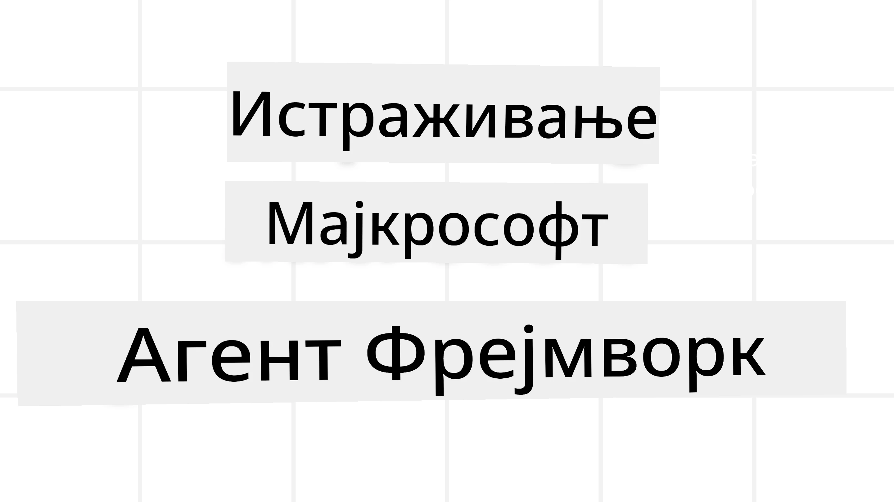

# Истраживање Microsoft Agent Framework-а



### Увод

Ова лекција ће обухватити:

- Разумевање Microsoft Agent Framework-а: Кључне карактеристике и вредности  
- Истраживање кључних концепата Microsoft Agent Framework-а
- Напредни MAF обрасци: Радни процеси, Middleware и меморија

## Циљеви учења

Након завршетка ове лекције, знаћете како да:

- Креирате AI агенте спремне за производњу користећи Microsoft Agent Framework
- Примените основне карактеристике Microsoft Agent Framework-а на ваше случаи употребе агената
- Користите напредне обрасце укључујући радне процесе, middleware и посматрање

## Примери кода 

Примери кода за [Microsoft Agent Framework (MAF)](https://aka.ms/ai-agents-beginners/agent-framework) се налазе у овом репозиторијуму под датотекама `xx-python-agent-framework` и `xx-dotnet-agent-framework`.

## Разумевање Microsoft Agent Framework-а


[Microsoft Agent Framework (MAF)](https://aka.ms/ai-agents-beginners/agent-framework) је јединствени оквир компаније Microsoft за креирање AI агената. Он нуди флексибилност за решавање широког спектра случајева употребе агената, како у производном окружењу, тако и у истраживачким срединама, укључујући:

- **Секвенцијална оркестрација агената** у сценаријима где су потребни корак по корак радни процеси.
- **Паралелна оркестрација** у сценаријима где агенти треба да истовремено изврше задатке.
- **Оркестрација групног ћаскања** у сценаријима где агенти могу заједно сарађивати на једном задатку.
- **Оркестрација преноса задатака** у сценаријима где агенти предају задатак један другом како се подзадаци завршавају.
- **Магнетска оркестрација** у сценаријима где агент менаџер креира и мења листу задатака и координише под-агенте да заврше задатак.

За испоруку AI агената у производњи, MAF такође укључује карактеристике за:

- **Посматрање** кроз коришћење OpenTelemetry-а где свака активност AI агента укључујући позив алата, кораке оркестрације, токове резоновања и праћење перформанси преко Microsoft Foundry панела.
- **Безбедност** тако што се агенти хостују нативно на Microsoft Foundry платформи која укључује безбедносне контроле као што су приступ заснован на улогама, руковање приватним подацима и уграђена заштита садржаја.
- **Издржљивост** јер се Agent процеси и радни токови могу паузирати, наставити и опоравити од грешака, што омогућава дуготрајне процесе.
- **Контрола** јер су подржани радни процеси са људским учесником у петљи где се задаци означавају као захтевајући људску сагласност.

Microsoft Agent Framework је такође фокусиран на интероперабилност кроз:

- **Облачно неутралан** - Агенти могу да раде у контејнерима, локално или кроз више различитих облака.
- **Провајдер-неутралан** - Агенти могу бити креирани путем вашег омиљеног SDK-а укључујући Azure OpenAI и OpenAI.
- **Интеграцију отворених стандарда** - Агенти могу користити протоколе попут Agent-to-Agent (A2A) и Model Context Protocol (MCP) да открију и користе друге агенте и алате.
- **Плугинe и конектори** - Повезивања могу бити направљена ка сервисима за податке и меморију као што су Microsoft Fabric, SharePoint, Pinecone и Qdrant.

Погледајмо како се ове функције примењују на неке од основних концепата Microsoft Agent Framework-а.

## Кључни концепти Microsoft Agent Framework-а

### Агенти


**Креирање агената**

Креирање агената се врши дефинисањем inference сервиса (LLM провајдера),
сета упутстава које AI агент следи, и додељеног `name`:

```python
agent = AzureOpenAIChatClient(credential=AzureCliCredential()).create_agent( instructions="You are good at recommending trips to customers based on their preferences.", name="TripRecommender" )
```

Горе се користи `Azure OpenAI` али агенти могу бити креирани коришћењем различитих сервиса укључујући и `Microsoft Foundry Agent Service`:

```python
AzureAIAgentClient(async_credential=credential).create_agent( name="HelperAgent", instructions="You are a helpful assistant." ) as agent
```

OpenAI `Responses`, `ChatCompletion` API-ји

```python
agent = OpenAIResponsesClient().create_agent( name="WeatherBot", instructions="You are a helpful weather assistant.", )
```

```python
agent = OpenAIChatClient().create_agent( name="HelpfulAssistant", instructions="You are a helpful assistant.", )
```

или [MiniMax](https://platform.minimaxi.com/), који пружа OpenAI-компатибилан API са великим контекст прозорима (до 204K токена):

```python
agent = OpenAIChatClient(base_url="https://api.minimax.io/v1", api_key=os.environ["MINIMAX_API_KEY"], model_id="MiniMax-M3").create_agent( name="HelpfulAssistant", instructions="You are a helpful assistant.", )
```

или удаљени агенти користећи A2A протокол:

```python
agent = A2AAgent( name=agent_card.name, description=agent_card.description, agent_card=agent_card, url="https://your-a2a-agent-host" )
```

**Покретање агената**

Агенти се покрећу користећи `.run` или `.run_stream` методе за одговарајуће не-стриминг или стриминг одговоре.

```python
result = await agent.run("What are good places to visit in Amsterdam?")
print(result.text)
```

```python
async for update in agent.run_stream("What are the good places to visit in Amsterdam?"):
    if update.text:
        print(update.text, end="", flush=True)

```

Сваки покретач агента може имати и опције за прилагођавање параметара као што су `max_tokens` које агент користи, `tools` које агент може да позове, па чак и сам `model` који агент користи.

Ово је корисно у случајевима када су потребни специфични модели или алати за извршење корисничког задатка.

**Алати**

Алати се могу дефинисати и приликом дефинисања агента:

```python
def get_attractions( location: Annotated[str, Field(description="The location to get the top tourist attractions for")], ) -> str: """Get the top tourist attractions for a given location.""" return f"The top attractions for {location} are." 


# Када директно креирате ChatAgent

agent = ChatAgent( chat_client=OpenAIChatClient(), instructions="You are a helpful assistant", tools=[get_attractions]

```

као и приликом покретања агента:

```python

result1 = await agent.run( "What's the best place to visit in Seattle?", tools=[get_attractions] # Алат обезбеђен само за ово извршавање )
```

**Agent Threads**

Agent Thread-ови се користе за руковање вишекратним разговорима. Thread-ови могу бити креирани на два начина:

- Коришћењем `get_new_thread()` што омогућава чување thread-а током времена
- Аутоматским креирањем thread-а приликом покретања агента који траје само током тог покретања.

Код за креирање thread-а изгледа овако:

```python
# Креирај нови нит.
thread = agent.get_new_thread() # Покрени агента са нити.
response = await agent.run("Hello, I am here to help you book travel. Where would you like to go?", thread=thread)

```

Након тога, thread се може серијализовати за каснију употребу:

```python
# Креирајте нови нит.
thread = agent.get_new_thread() 

# Покрените агента са нитима.

response = await agent.run("Hello, how are you?", thread=thread) 

# Сериализујте нит за складиштење.

serialized_thread = await thread.serialize() 

# Десериализујте стање нити након учитавања из складишта.

resumed_thread = await agent.deserialize_thread(serialized_thread)
```

**Agent Middleware**

Агенти интерактују са алатима и LLM-овима да би извршили корисничке задатке. У одређеним сценаријима желимо да извршимо или пратимо радње између тих интеракција. Agent middleware нам то омогућава кроз:

*Функцијски middleware*

Овај middleware нам омогућава да извршимо акцију између агента и функције/алата које позива. Пример употребе је када желите да забележите позив функције.

У примеру испод `next` дефинише да ли треба позвати следећи middleware или стварну функцију.

```python
async def logging_function_middleware(
    context: FunctionInvocationContext,
    next: Callable[[FunctionInvocationContext], Awaitable[None]],
) -> None:
    """Function middleware that logs function execution."""
    # Предобрада: Запис пре извршавања функције
    print(f"[Function] Calling {context.function.name}")

    # Настави на следећи међупроцес или извршавање функције
    await next(context)

    # Постобрада: Запис после извршавања функције
    print(f"[Function] {context.function.name} completed")
```

*Chat middleware*

Овај middleware дозвољава извршавање или логовање између агента и захтева ка LLM.

Ово садржи важне информације као што су `messages` који се шаљу AI сервису.

```python
async def logging_chat_middleware(
    context: ChatContext,
    next: Callable[[ChatContext], Awaitable[None]],
) -> None:
    """Chat middleware that logs AI interactions."""
    # Претходна обрада: Лог пре позива AI
    print(f"[Chat] Sending {len(context.messages)} messages to AI")

    # Настави на следећи middleware или AI сервис
    await next(context)

    # Накнадна обрада: Лог након одговора AI
    print("[Chat] AI response received")

```

**Agent Memory**

Као што је објашњено у лекцији `Agentic Memory`, меморија је важан елемент који омогућава агенту да ради у различитим контекстима. MAF нуди више типова меморије:

*Упамћена меморија (In-Memory Storage)*

Ово је меморија која се чува у thread-овима током рада апликације.

```python
# Креирајте нови нит.
thread = agent.get_new_thread() # Покрените агента са нитју.
response = await agent.run("Hello, I am here to help you book travel. Where would you like to go?", thread=thread)
```

*Перзистентне поруке*

Ова меморија се користи за чување историје разговора између различитих сесија. Дефинише се помоћу `chat_message_store_factory`:

```python
from agent_framework import ChatMessageStore

# Креирајте прилагођену продавницу порука
def create_message_store():
    return ChatMessageStore()

agent = ChatAgent(
    chat_client=OpenAIChatClient(),
    instructions="You are a Travel assistant.",
    chat_message_store_factory=create_message_store
)

```

*Динамичка меморија*

Ова меморија се додaje у контекст пре покретања агената. Могу се чувати у екстерним сервисима као што је mem0:

```python
from agent_framework.mem0 import Mem0Provider

# Користећи Mem0 за напредне могућности меморије
memory_provider = Mem0Provider(
    api_key="your-mem0-api-key",
    user_id="user_123",
    application_id="my_app"
)

agent = ChatAgent(
    chat_client=OpenAIChatClient(),
    instructions="You are a helpful assistant with memory.",
    context_providers=memory_provider
)

```

**Agent Посматрање (Observability)**

Посматрање је битно за изградњу поузданих и одрживих агентских система. MAF се интегрише са OpenTelemetry-ом да обезбеди праћење и мерење за боље посматрање.

```python
from agent_framework.observability import get_tracer, get_meter

tracer = get_tracer()
meter = get_meter()
with tracer.start_as_current_span("my_custom_span"):
    # уради нешто
    pass
counter = meter.create_counter("my_custom_counter")
counter.add(1, {"key": "value"})
```

### Радни процеси (Workflows)

MAF нуди радне процесе који представљају унапред дефинисане кораке за извршење задатка и укључују AI агенте као компоненте тих корака.

Радни процеси су састављени од различитих компоненти које омогућавају бољу контролу тока. Радни процеси такође омогућавају **оркестрацију више агената** и **чување стања** за наставак радног процеса.

Основне компоненте радног процеса су:

**Извршиоци (Executors)**

Извршиоци примају улазне поруке, обављају додељене задатке, и производе излазне поруке. Ово помера радни процес ка завршетку већег задатка. Извршиоци могу бити AI агент или прилагођена логика.

**Ивице (Edges)**

Ивице се користе за дефинисање тока порука у радном процесу. Оне могу бити:

*Директне ивице* - Једноставне један-на-један везе између извршилаца:

```python
from agent_framework import WorkflowBuilder

builder = WorkflowBuilder()
builder.add_edge(source_executor, target_executor)
builder.set_start_executor(source_executor)
workflow = builder.build()
```

*Условне ивице* - Активирају се након испуњења одређеног услова. На пример, када собе у хотелу нису доступне, извршилац може предложити друге опције.

*Switch-case ивице* - Усмеравју поруке различитим извршицима на основу дефинисаних услова. На пример, ако путник има приоритетан приступ, њихови задаци ће бити обрађени кроз други радни процес.

*Fan-out ивице* - Шаљу једну поруку више одредишта.

*Fan-in ивице* - Прикупљају више порука од различитих извршилаца и шаљу једном одредишту.

**Догађаји (Events)**

Да би се обезбедило боље посматрање у радним процесима, MAF нуди уграђене догађаје за извршење укључујући:

- `WorkflowStartedEvent`  - Покретање извршења радног процеса
- `WorkflowOutputEvent` - Радни процес генерише излаз
- `WorkflowErrorEvent` - Радни процес сретне грешку
- `ExecutorInvokeEvent`  - Извршилац почиње са обрадом
- `ExecutorCompleteEvent`  - Извршилац завршава обраду
- `RequestInfoEvent` - Захтев је послат

## Напредни обрасци MAF-а

Горње секције обухватају кључне концепте Microsoft Agent Framework-а. Како правите сложеније агенте, ево неких напредних образаца које треба размотрити:

- **Композиција Middleware-а**: Повежите више middleware обрадјивача (логовање, аутентификација, ограничење брзине) користећи функцијски и chat middleware за фину контролу понашања агента.
- **Чување стања радног процеса**: Користите догађаје радног процеса и серијализацију да сачувате и наставите дуготрајне агентске процесе.
- **Динамички избор алата**: Комбинујте RAG преко описа алата са регистрацијом алата у MAF-у да бисте представили само релевантне алате по упиту.
- **Пренос између више агената**: Користите ивице радног процеса и условно усмеравње да оркестрирате пренос задатака између специјализованих агената.

## Хостовање LangChain / LangGraph агената на Microsoft Foundry-у

Microsoft Agent Framework је **интероперабилан са другим оквирима** — нисте ограничени на агенте написане уз MAF. Ако већ имате агента креираног са **LangChain** или **LangGraph**, можете га покренути као **агента хостованог на Microsoft Foundry** тако да Foundry управља извршењем, сесијама, скалабилношћу, идентитетом и протоколским крајњим тачкама, док ваша логика агента остаје у LangGraph-у.

Ово се постиже преко пакета `langchain_azure_ai.agents.hosting`, који излаже компајлирани LangGraph граф преко истих протокола које користе Foundry хостовани агенти.

**1. Инсталирајте hosting екстра:**

```bash
pip install -U "langchain-azure-ai[hosting]>=1.2.4" azure-identity
```

`hosting` екстра инсталира Foundry протоколске библиотеке: `azure-ai-agentserver-responses` (OpenAI-компатибилна `/responses` крајња тачка) и `azure-ai-agentserver-invocations` (општа `/invocations` крајња тачка).

**2. Изаберите hosting протокол:**

| Протокол | Host класа | Крајња тачка | Користи се када |
|----------|------------|-------------|-----------------|
| **Responses** | `ResponsesHostServer` | `/responses` | Желите OpenAI-компатибилан чат, стриминг, историју одговора и везе разговора — препоручено подразумевано за конверзационе агенте. |
| **Invocations** | `InvocationsHostServer` | `/invocations` | Потребан вам је прилагођени JSON формат, вебхук стил крајња тачка или не-конверзацијска обрада. |

Пошто је **Responses API главни API за развој агената у Foundry-у**, почните са `ResponsesHostServer` за већину агената.

**3. Конфигуришите окружење** (прво `az login` да `DefaultAzureCredential` може да аутентификује):

```bash
export FOUNDRY_PROJECT_ENDPOINT="https://<resource>.services.ai.azure.com/api/projects/<project>"
export FOUNDRY_MODEL_NAME="gpt-5-mini"
```

Када агент касније ради као хостовани агент у Foundry-у, платформа аутоматски инјектује `FOUNDRY_PROJECT_ENDPOINT`.

**4. Изложите LangGraph агента преко Responses протокола:**

```python
import os

from azure.ai.projects import AIProjectClient
from azure.identity import DefaultAzureCredential, get_bearer_token_provider
from langchain.agents import create_agent
from langchain_openai import ChatOpenAI
from langchain_azure_ai.agents.hosting import ResponsesHostServer

_AZURE_AI_SCOPE = "https://ai.azure.com/.default"


def build_chat_model() -> ChatOpenAI:
    project_endpoint = os.environ["FOUNDRY_PROJECT_ENDPOINT"].rstrip("/")
    deployment = os.environ.get("FOUNDRY_MODEL_NAME", "gpt-5-mini")
    credential = DefaultAzureCredential()
    project = AIProjectClient(endpoint=project_endpoint, credential=credential)
    openai_client = project.get_openai_client()
    token_provider = get_bearer_token_provider(credential, _AZURE_AI_SCOPE)

    # ChatOpenAI овде циља на OpenAI-компатибилни (Responses) крајњи пут Foundry пројекта.
    return ChatOpenAI(
        model=deployment,
        base_url=str(openai_client.base_url),
        api_key=token_provider,
    )


def main() -> None:
    graph = create_agent(build_chat_model(), tools=[])
    port = int(os.environ.get("PORT", "8088"))
    ResponsesHostServer(graph).run(port=port)


if __name__ == "__main__":
    main()
```

Покрените локално са `python main.py`, затим пошаљите Responses захтев на `http://localhost:8088/responses`.

**Кључна понашања:**

- **Разговори**: Клијенти настављају разговор прослеђујући `previous_response_id` или `conversation` ID. Ако је ваш граф компајлиран са LangGraph checkpoint-ом, Foundry повезује стање разговора са checkpoint-ом (користите трајни checkpoint у производњи; `MemorySaver` је добар за локално тестирање).
- **Људска контрола ("Human-in-the-loop")**: Ако ваш граф користи LangGraph `interrupt()`, `ResponsesHostServer` приказује очекивани interrupt као Responses `function_call` / `mcp_approval_request` ставку, а клијенти настављају са одговарајућим `function_call_output` / `mcp_approval_response`.
- **Деплој на Foundry**: Користите Azure Developer CLI — `azd ext install azure.ai.agents`, `azd ai agent init -m <manifest>`, `azd ai agent run` (локално, захтева Docker), затим `azd provision` и `azd deploy`. Deploy хостованих агената захтева улогу **Foundry Project Manager**.

Радна верзија овог примера налази се у [code-samples/14-langchain-hosted-agent.py](../../../14-microsoft-agent-framework/code-samples/14-langchain-hosted-agent.py). За комплетан водич (Invocations протокол, прилагођени обрасци захтева и решавање проблема), погледајте [Host LangGraph agents as Foundry hosted agents](https://learn.microsoft.com/azure/foundry/how-to/develop/langchain-hosted-agents).

## Примери кода 

Примери кода за Microsoft Agent Framework могу се пронаћи у овом репозиторијуму под датотекама `xx-python-agent-framework` и `xx-dotnet-agent-framework`.

## Имате још питања о Microsoft Agent Framework-у?

Придружите се [Microsoft Foundry Discord](https://discord.com/invite/ATgtXmAS5D) да упознате друге ученике, посетите office hours и добијете одговоре на питања о AI агентима.
## Претходна лекција

[Memory for AI Agents](../13-agent-memory/README.md)

## Следећа лекција

[Building Computer Use Agents (CUA)](../15-browser-use/README.md)

---

<!-- CO-OP TRANSLATOR DISCLAIMER START -->
**Изјава о одрицању одговорности**:
Овај документ је преведен коришћењем услуге за аутоматски превод [Co-op Translator](https://github.com/Azure/co-op-translator). Иако тежимо тачности, имајте у виду да аутоматски преводи могу садржати грешке или нетачности. Оригинални документ на његовом изворном језику треба сматрати ауторитативним извором. За критичне информације препоручује се професионални људски превод. Нисмо одговорни за било каква неспоразума или погрешна тумачења која произилазе из коришћења овог превода.
<!-- CO-OP TRANSLATOR DISCLAIMER END -->