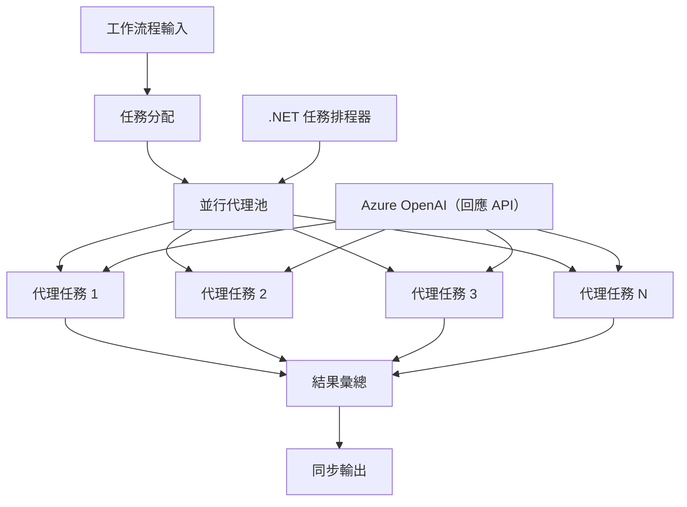

# ⚡ 使用 Azure OpenAI (Responses API) 的並行代理工作流程 (.NET)

## 📋 高效能平行處理教學

本筆記本示範如何使用 Microsoft Agent Framework for .NET 和 Azure OpenAI (Responses API) 實現<strong>並行工作流程模式</strong>。您將學習如何構建高效能的平行處理工作流程，通過同時執行多個 AI 代理來最大化吞吐量，並保持協調和資料一致性。

## 🎯 學習目標

### 🚀 <strong>並行處理基礎</strong>
- <strong>平行代理執行</strong>：同時運行多個 AI 代理以達到最高效能
- **Async/Await 模式**：利用 .NET 的非同步編程模型實現高效的並行性
- **Azure OpenAI (Responses API)**：協調多個並行呼叫 Azure OpenAI Responses API
- <strong>資源管理</strong>：有效管理並行操作中的 AI 模型資源

### 🏗️ <strong>進階並行架構</strong>
- <strong>基於任務的平行處理</strong>：使用 .NET 任務平行庫實現最佳並行執行
- <strong>同步模式</strong>：協調並行代理，避免競態條件
- <strong>負載平衡</strong>：有效分配工作於可用並行處理容量
- <strong>容錯能力</strong>：個別代理失敗時不停止整個工作流程

### 🏢 <strong>企業級並行應用</strong>
- <strong>大批量文件處理</strong>：同時處理多份文件
- <strong>即時內容分析</strong>：並行分析傳入數據流
- <strong>批次處理優化</strong>：最大化大型數據處理操作的吞吐量
- <strong>多模態分析</strong>：並行處理不同內容類型和格式

## ⚙️ 需求與設定

### 📦 **所需 NuGet 套件**

高效能並行工作流程所需的基本套件：

```xml
<!-- Core AI Framework with Async Support -->
<PackageReference Include="Microsoft.Extensions.AI" Version="10.*" />

<!-- Azure OpenAI (Responses API) -->
<PackageReference Include="Azure.AI.OpenAI" Version="2.*" />

<!-- Azure Identity and Async LINQ for Advanced Operations -->
<PackageReference Include="Azure.Identity" Version="1.15.0" />
<PackageReference Include="System.Linq.Async" Version="6.0.3" />

<!-- Local Agent Framework References -->
<!-- Microsoft.Agents.AI.dll - Core agent abstractions with async support -->
<!-- Microsoft.Agents.AI.OpenAI.dll - Azure OpenAI (Responses API) integration with concurrency -->
```

### 🔑 **Azure OpenAI 設定**

**環境設定 (.env 檔案)：**
```env
AZURE_OPENAI_ENDPOINT=https://<your-resource>.openai.azure.com
AZURE_OPENAI_DEPLOYMENT=gpt-5-mini
```

**並行處理注意事項：**
```csharp
// Configure for concurrent operations
var clientOptions = new AzureOpenAIClientOptions()
{
    // Configure network timeout for concurrent requests
    NetworkTimeout = TimeSpan.FromMinutes(5)
};
```

### 🏗️ <strong>並行工作流程架構</strong>



**主要元件：**
- <strong>任務平行庫</strong>：.NET 內建支援並行操作
- <strong>代理池</strong>：多個代理實例並行處理
- <strong>結果彙整</strong>：協調並合併並行代理結果
- <strong>同步點</strong>：確保並行操作間資料一致性

## 🎨 <strong>並行工作流程設計模式</strong>

### 🔍 <strong>平行研究與分析</strong>
```
Research Topic → Concurrent Research Agents → Result Synthesis → Final Report
```

### 📊 <strong>多來源資料處理</strong>
```
Data Sources → Parallel Processing Agents → Data Integration → Unified Output
```

### 🎭 <strong>內容產生管線</strong>
```
Content Requirements → Concurrent Content Generators → Quality Review → Final Content
```

### 🔄 **Fan-Out/Fan-In 處理**
```
Single Input → Multiple Concurrent Processors → Result Aggregation → Single Output
```

## 🏢 <strong>企業效能優勢</strong>

### ⚡ <strong>吞吐量與擴展性</strong>
- <strong>線性效能擴展</strong>：增加並行代理數量以提升吞吐量
- <strong>資源利用率</strong>：最大化可用 AI 模型容量的效率
- <strong>縮短處理時間</strong>：透過平行執行顯著減少時間
- <strong>彈性擴展</strong>：根據工作負載動態調整並行代理數量

### 🛡️ <strong>可靠性與韌性</strong>
- <strong>故障隔離</strong>：個別代理失效不影響其他並行操作
- <strong>優雅降級</strong>：系統以降低的代理容量繼續運作
- <strong>錯誤復原</strong>：對失敗的並行操作自動重試機制
- <strong>負載分配</strong>：平均分配工作至可用代理

### 📊 <strong>效能監控</strong>
- <strong>並行執行指標</strong>：追蹤所有平行操作的效能
- <strong>資源使用分析</strong>：監控 CPU、記憶體和網路使用率
- <strong>吞吐量分析</strong>：衡量並行處理所帶來的效率提升
- <strong>瓶頸偵測</strong>：識別並解決效能限制

### 🔧 <strong>開發與運營</strong>
- <strong>非同步程式模型</strong>：利用 .NET 成熟的 async/await 模式
- <strong>任務協調</strong>：內建任務管理和協調功能
- <strong>例外處理</strong>：全面的並行操作錯誤處理
- <strong>除錯支援</strong>：Visual Studio 的並行工作流程除錯工具

讓我們用 .NET 建構高效能並行 AI 工作流程吧！ 🚀

## 💻 代碼執行

完整實作位於 `03.dotnet-agent-framework-workflow-ghmodel-concurrent.cs`，此檔展示了旅遊規劃的<strong>Fan-Out/Fan-In 並行工作流程</strong>：

### 🏗️ <strong>工作流程架構</strong>

```
User Request → ConcurrentStartExecutor → [Researcher Agent || Planner Agent] → ConcurrentAggregationExecutor → Final Output
```

**主要元件：**

1. **ConcurrentStartExecutor**：同時將使用者請求廣播給所有代理
2. **Researcher Agent**：並行分析目的地與景點
3. **Planner Agent**：並行編制詳細旅遊計畫
4. **ConcurrentAggregationExecutor**：收集並匯總兩個代理的結果

### 🎯 **Fan-Out/Fan-In 模式**

本工作流程演示了經典的 **Fan-Out/Fan-In** 模式：
- **Fan-Out**：一個輸入訊息同時廣播到多個代理
- <strong>並行處理</strong>：多個代理平行處理相同任務
- **Fan-In**：收集所有代理結果，彙整為單一輸出

### 🚀 執行範例

```bash
# 令腳本可執行（Unix/Linux/macOS）
chmod +x 03.dotnet-agent-framework-workflow-ghmodel-concurrent.cs

# 執行並發工作流程
./03.dotnet-agent-framework-workflow-ghmodel-concurrent.cs
```

Windows 環境執行：
```powershell
dotnet run 03.dotnet-agent-framework-workflow-ghmodel-concurrent.cs
```

### 📝 預期輸出

工作流程將：
1. <strong>廣播請求</strong>：將「計劃十二月去西雅圖的旅程」發送給兩個代理
2. <strong>並行處理</strong>：兩個代理同時工作：
   - 研究員負責鑑定景點及細節
   - 規劃員製作行程與後勤安排
3. <strong>結果彙整</strong>：合併兩份回應成綜合輸出
4. <strong>結果展示</strong>：顯示所有資訊整合的旅遊計畫

### 🔧 自訂選項

**新增更多並行代理：**
```csharp
// Create additional specialized agents
AIAgent budgetAgent = azureClient.GetChatClient(deployment).AsAIAgent(
    name: "Budget-Agent", instructions: "Calculate travel costs...");

// Add to fan-out
var workflow = new WorkflowBuilder(startExecutor)
    .AddFanOutEdge(startExecutor, targets: [researcherAgent, plannerAgent, budgetAgent])
    .AddFanInBarrierEdge(sources: [researcherAgent, plannerAgent, budgetAgent], target: aggregationExecutor)
    .WithOutputFrom(aggregationExecutor)
    .Build();

// Update aggregation count
if (this._messages.Count == 3) { ... }
```

**修改代理指令：**
```csharp
const string ResearcherAgentInstructions = "Your custom instructions for research...";
const string PlanAgentInstructions = "Your custom instructions for planning...";
```

**變更任務內容：**
```csharp
StreamingRun run = await InProcessExecution.RunStreamingAsync(
    workflow, 
    "Plan a European vacation for 2 weeks in summer"
);
```

### 🎯 實際應用場景

此並行模式非常適合：
- <strong>內容創作</strong>：多名作者同時創作不同章節
- <strong>程式碼審查</strong>：多位審查者從不同角度分析程式碼
- <strong>市場調查</strong>：平行分析不同市場區段
- <strong>文件處理</strong>：並行進行抽取、分析與驗證
- <strong>多視角分析</strong>：獲得同一輸入的多元觀點

### 🔍 理解自訂執行器

**ConcurrentStartExecutor：**
- 實作 `IMessageHandler<string>` 接受字串輸入
- 廣播訊息給所有連線代理
- 發送 `TurnToken` 以觸發並行處理

**ConcurrentAggregationExecutor：**
- 實作 `IMessageHandler<ChatMessage>` 接收代理回應
- 以執行緒安全方式收集訊息
- 當收到所有預期回應後執行彙整
- 使用 `context.YieldOutputAsync()` 傳回最終輸出

### ⚡ 效能優勢

**並行 vs 順序：**
- 順序：代理1 (30秒) → 代理2 (30秒) = **共 60 秒**
- 並行：代理1 (30秒) || 代理2 (30秒) = **共 30 秒**

<strong>吞吐量提升</strong>：對於 N 個並行代理，提升可達 N 倍（視工作負載與資源而定）

### 🛡️ 錯誤處理

工作流程能優雅處理個別代理失效：
- 一個代理失敗，其他代理繼續執行
- 匯整器可實作超時邏輯
- 必要時可返回部分結果

### 📊 進階功能

**動態代理數量：**
修改彙整邏輯以支援變動代理數量：

```csharp
private int _expectedAgentCount;
private readonly List<ChatMessage> _messages = [];

public override ValueTask HandleAsync(ChatMessage message, IWorkflowContext context, CancellationToken cancellationToken = default)
{
    this._messages.Add(message);
    if (this._messages.Count == _expectedAgentCount)
    {
        // Process aggregation
    }
    
    return ValueTask.CompletedTask;
}
```

此並行工作流程模式是構建高效能、可擴展 AI 代理系統的關鍵！

---

<!-- CO-OP TRANSLATOR DISCLAIMER START -->
**免責聲明**：
本文件由 AI 翻譯服務 [Co-op Translator](https://github.com/Azure/co-op-translator) 翻譯而成。雖然我們致力於確保準確性，但請注意，機器自動翻譯可能包含錯誤或不準確之處。原始文件的母語版本應被視為權威來源。對於重要資訊，建議進行專業人工翻譯。我們不對因使用本翻譯而產生的任何誤解或誤釋承擔責任。
<!-- CO-OP TRANSLATOR DISCLAIMER END -->