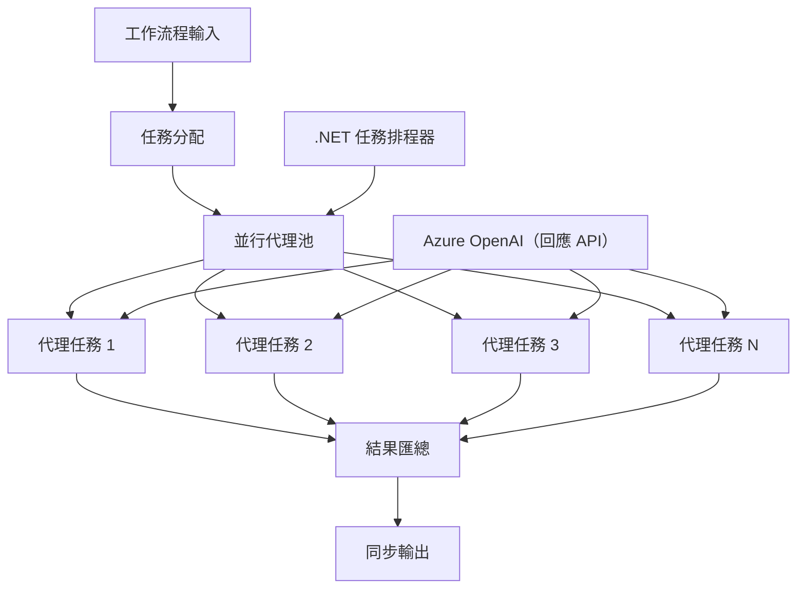

# ⚡ 使用 Azure OpenAI (Responses API) 的 .NET 並發代理工作流程

## 📋 高效能平行處理教學

本筆記本示範如何使用 Microsoft Agent Framework for .NET 以及 Azure OpenAI (Responses API) 實現<strong>並行工作流程模式</strong>。您將學會如何構建高效能的平行處理工作流程，通過同時執行多個 AI 代理，最大化吞吐量，同時維持協調與資料一致性。

## 🎯 學習目標

### 🚀 <strong>並行處理基礎</strong>
- <strong>平行代理執行</strong>：同時運行多個 AI 代理以達到最佳效能
- **Async/Await 模式**：運用 .NET 的 async 程式設計模型實現高效併發
- **Azure OpenAI (Responses API)**：協調多個並行呼叫 Azure OpenAI Responses API
- <strong>資源管理</strong>：高效管理多個並行操作中的 AI 模型資源

### 🏗️ <strong>進階併發架構</strong>
- <strong>基於工作任務的平行處理</strong>：利用 .NET 的 Task Parallel Library 進行最佳併發執行
- <strong>同步模式</strong>：協調並發代理以避免競態條件
- <strong>負載平衡</strong>：高效地分配工作到可用的並行處理容量
- <strong>容錯能力</strong>：處理單一代理失敗而不停止整個工作流程

### 🏢 <strong>企業級併發應用</strong>
- <strong>高量文件處理</strong>：同時處理多個文件
- <strong>即時內容分析</strong>：併發分析流入資料串流
- <strong>批次處理優化</strong>：最大化大規模資料處理吞吐量
- <strong>多模態分析</strong>：並行處理不同內容類型與格式

## ⚙️ 前置需求與設定

### 📦 **必要的 NuGet 套件**

高效能並發工作流程所需的重要套件：

```xml
<!-- Core AI Framework with Async Support -->
<PackageReference Include="Microsoft.Extensions.AI" Version="10.*" />

<!-- Azure OpenAI (Responses API) -->
<PackageReference Include="Azure.AI.OpenAI" Version="2.*" />

<!-- Azure Identity and Async LINQ for Advanced Operations -->
<PackageReference Include="Azure.Identity" Version="1.15.0" />
<PackageReference Include="System.Linq.Async" Version="6.0.3" />

<!-- Local Agent Framework References -->
<!-- Microsoft.Agents.AI.dll - Core agent abstractions with async support -->
<!-- Microsoft.Agents.AI.OpenAI.dll - Azure OpenAI (Responses API) integration with concurrency -->
```

### 🔑 **Azure OpenAI 設定**

**環境設定 (.env 檔案)：**
```env
AZURE_OPENAI_ENDPOINT=https://<your-resource>.openai.azure.com
AZURE_OPENAI_DEPLOYMENT=gpt-5-mini
```

**並發處理注意事項：**
```csharp
// Configure for concurrent operations
var clientOptions = new AzureOpenAIClientOptions()
{
    // Configure network timeout for concurrent requests
    NetworkTimeout = TimeSpan.FromMinutes(5)
};
```

### 🏗️ <strong>並發工作流程架構</strong>



**主要元件：**
- **Task Parallel Library**：.NET 內建支援併發操作
- <strong>代理池</strong>：多個代理實例進行平行處理
- <strong>結果彙總</strong>：協調並合併多個代理的結果
- <strong>同步點</strong>：確保並行作業中的資料一致性

## 🎨 <strong>並發工作流程設計模式</strong>

### 🔍 <strong>平行研究與分析</strong>
```
Research Topic → Concurrent Research Agents → Result Synthesis → Final Report
```

### 📊 <strong>多來源資料處理</strong>
```
Data Sources → Parallel Processing Agents → Data Integration → Unified Output
```

### 🎭 <strong>內容生成管線</strong>
```
Content Requirements → Concurrent Content Generators → Quality Review → Final Content
```

### 🔄 **展開/收斂處理模式**
```
Single Input → Multiple Concurrent Processors → Result Aggregation → Single Output
```

## 🏢 <strong>企業效能優勢</strong>

### ⚡ <strong>吞吐量與可擴展性</strong>
- <strong>線性效能擴展</strong>：增加更多併發代理以提升吞吐
- <strong>資源利用率</strong>：最大化現有 AI 模型容量的效率
- <strong>縮短處理時間</strong>：透過平行執行大幅節省時間
- <strong>彈性擴縮</strong>：根據工作負載動態調整並行代理數量

### 🛡️ <strong>可靠性與韌性</strong>
- <strong>故障隔離</strong>：單一代理失敗不影響其他併發操作
- <strong>優雅降級</strong>：系統在代理容量減少時仍繼續運行
- <strong>錯誤復原</strong>：失敗操作自動重試機制
- <strong>負載分配</strong>：均衡分配工作到可用代理

### 📊 <strong>效能監控</strong>
- <strong>併發執行指標</strong>：追蹤所有平行操作效能
- <strong>資源使用分析</strong>：監控 CPU、記憶體及網路使用情況
- <strong>吞吐量分析</strong>：衡量併發處理帶來的效能提升
- <strong>瓶頸偵測</strong>：識別並解決效能限制問題

### 🔧 <strong>開發與運維</strong>
- <strong>非同步程式模型</strong>：採用 .NET 成熟的 async/await 模式
- <strong>任務協調</strong>：內建的任務管理與協調功能
- <strong>例外處理</strong>：全面的併發操作錯誤處理
- <strong>除錯支援</strong>：Visual Studio 併發工作流程除錯工具

讓我們一起用 .NET 建立高效能並行的 AI 工作流程吧！🚀

## 💻 執行程式碼

完整實作位於 `03.dotnet-agent-framework-workflow-ghmodel-concurrent.cs`，此檔示範了旅遊規劃的<strong>展開/收斂並行工作流程</strong>：

### 🏗️ <strong>工作流程架構</strong>

```
User Request → ConcurrentStartExecutor → [Researcher Agent || Planner Agent] → ConcurrentAggregationExecutor → Final Output
```

**主要元件：**

1. **ConcurrentStartExecutor**：同時向所有代理廣播使用者請求
2. **Researcher Agent**：並行分析目的地與景點
3. **Planner Agent**：並行創建詳細旅行計劃
4. **ConcurrentAggregationExecutor**：收集並合併兩個代理的結果

### 🎯 **展開/收斂模式**

此工作流程示範經典的<strong>展開/收斂</strong>模式：
- <strong>展開</strong>：一個輸入訊息同時廣播給多個代理
- <strong>並行處理</strong>：多個代理平行執行相同任務
- <strong>收斂</strong>：收集所有代理的結果並整合成單一輸出

### 🚀 執行範例

```bash
# 令腳本可執行 (Unix/Linux/macOS)
chmod +x 03.dotnet-agent-framework-workflow-ghmodel-concurrent.cs

# 執行並行工作流程
./03.dotnet-agent-framework-workflow-ghmodel-concurrent.cs
```

Windows 上執行指令：
```powershell
dotnet run 03.dotnet-agent-framework-workflow-ghmodel-concurrent.cs
```

### 📝 預期輸出

工作流程將：
1. <strong>廣播請求</strong>：向兩個代理發送「規劃十二月前往西雅圖的行程」
2. <strong>平行處理</strong>：兩個代理同時工作：
   - 研究者找出景點和詳細資訊
   - 計劃者制定行程與後勤安排
3. <strong>結果彙總</strong>：將兩者回覆合並為完整輸出
4. <strong>顯示結果</strong>：展示包含所有資訊的合併旅行計劃

### 🔧 客製化選項

**新增更多並發代理：**
```csharp
// Create additional specialized agents
AIAgent budgetAgent = azureClient.GetChatClient(deployment).AsAIAgent(
    name: "Budget-Agent", instructions: "Calculate travel costs...");

// Add to fan-out
var workflow = new WorkflowBuilder(startExecutor)
    .AddFanOutEdge(startExecutor, targets: [researcherAgent, plannerAgent, budgetAgent])
    .AddFanInBarrierEdge(sources: [researcherAgent, plannerAgent, budgetAgent], target: aggregationExecutor)
    .WithOutputFrom(aggregationExecutor)
    .Build();

// Update aggregation count
if (this._messages.Count == 3) { ... }
```

**修改代理指令：**
```csharp
const string ResearcherAgentInstructions = "Your custom instructions for research...";
const string PlanAgentInstructions = "Your custom instructions for planning...";
```

**更改任務內容：**
```csharp
StreamingRun run = await InProcessExecution.RunStreamingAsync(
    workflow, 
    "Plan a European vacation for 2 weeks in summer"
);
```

### 🎯 真實應用場景

此並行模式適合：
- <strong>內容創作</strong>：多位作者同時創作不同章節
- <strong>程式碼審查</strong>：多個審查者從不同角度分析程式碼
- <strong>市場調查</strong>：平行分析不同市場區段
- <strong>文件處理</strong>：併發進行抽取、分析與驗證
- <strong>多視角分析</strong>：從多元觀點分析相同輸入

### 🔍 理解自訂執行器

**ConcurrentStartExecutor：**
- 實作 `IMessageHandler<string>` 接收字串輸入
- 廣播訊息給所有連接代理
- 發送 `TurnToken` 觸發並行處理

**ConcurrentAggregationExecutor：**
- 實作 `IMessageHandler<ChatMessage>` 接收代理回應
- 以執行緒安全方式收集訊息
- 當所有預期回應到達後彙總結果
- 使用 `context.YieldOutputAsync()` 輸出最終結果

### ⚡ 效能優勢

**並行 vs 順序：**
- 順序：Agent1（30秒）→ Agent2（30秒）= **總共 60 秒**
- 並行：Agent1（30秒）|| Agent2（30秒）= **總共 30 秒**

<strong>吞吐量提升</strong>：對 N 個並行代理可提升至 N 倍速（取決於工作負載與資源）

### 🛡️ 錯誤處理

工作流程可優雅處理單一代理失敗：
- 若一代理失敗，其他代理繼續工作
- 彙總器可實作逾時邏輯
- 必要時可回傳部分結果

### 📊 進階功能

**動態代理數量：**
修改彙總邏輯以支持可變代理數：

```csharp
private int _expectedAgentCount;
private readonly List<ChatMessage> _messages = [];

public override ValueTask HandleAsync(ChatMessage message, IWorkflowContext context, CancellationToken cancellationToken = default)
{
    this._messages.Add(message);
    if (this._messages.Count == _expectedAgentCount)
    {
        // Process aggregation
    }
    
    return ValueTask.CompletedTask;
}
```

此並行工作流程模式是打造高效能且可擴展 AI 代理系統的關鍵！

---

<!-- CO-OP TRANSLATOR DISCLAIMER START -->
**免責聲明**：
本文件使用 AI 翻譯服務 [Co-op Translator](https://github.com/Azure/co-op-translator) 進行翻譯。雖然我們力求準確，但請注意，自動翻譯可能包含錯誤或不準確之處。原始文件的母語版本應被視為權威來源。對於重要資訊，建議尋求專業人工翻譯。我們不對因使用本翻譯而引起的任何誤解或曲解承擔責任。
<!-- CO-OP TRANSLATOR DISCLAIMER END -->