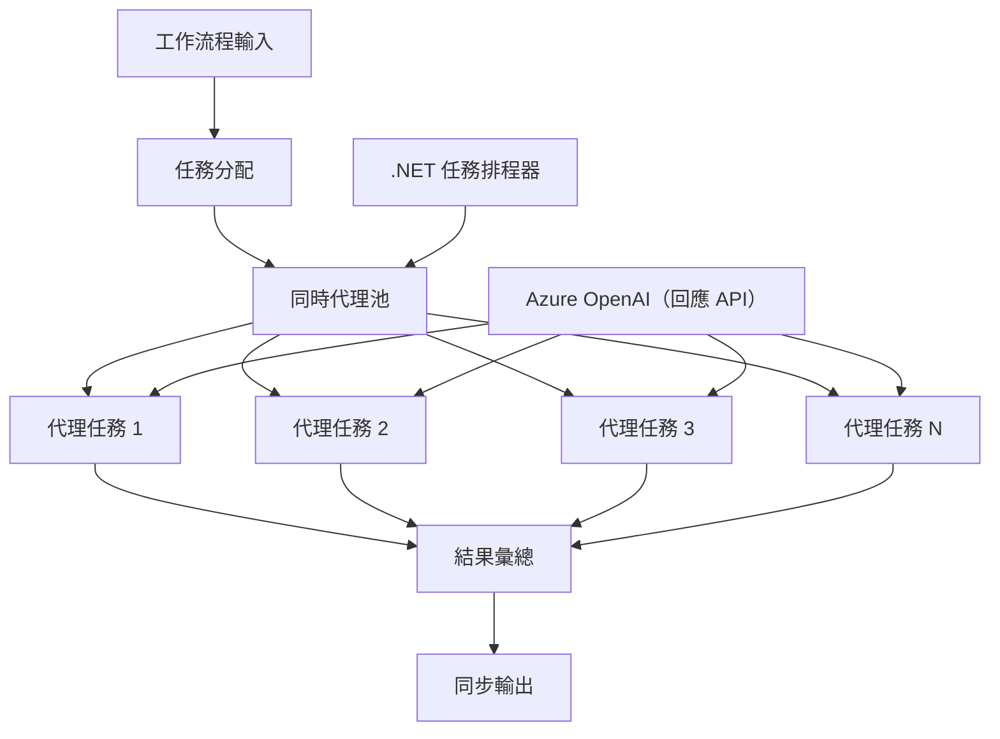

# ⚡ 使用 Azure OpenAI（Responses API）與 .NET 實現並行代理工作流程

## 📋 高效平行處理教學

本筆記本演示了使用 Microsoft Agent Framework for .NET 及 Azure OpenAI（Responses API）的<strong>並行工作流程模式</strong>。您將學會如何建立高效能的平行處理工作流程，透過同時執行多個 AI 代理來達到最大吞吐量，同時保持協調和資料一致性。

## 🎯 學習目標

### 🚀 <strong>並行處理基礎</strong>
- <strong>平行代理執行</strong>：同時執行多個 AI 代理以達到最高效能
- **Async/Await 模式**：利用 .NET 的非同步編程模型實現高效並行
- **Azure OpenAI（Responses API）**：協調多個對 Azure OpenAI Responses API 的並行呼叫
- <strong>資源管理</strong>：有效管理跨並行操作的 AI 模型資源

### 🏗️ <strong>進階並發架構</strong>
- <strong>基於任務的平行處理</strong>：使用 .NET Task Parallel Library 以獲得最佳並行執行
- <strong>同步模式</strong>：協調並行代理操作並避免競爭條件
- <strong>負載平衡</strong>：有效分配工作於可用的並行處理容量
- <strong>容錯能力</strong>：處理單一代理失敗而不停止整體工作流程

### 🏢 <strong>企業級並行應用</strong>
- <strong>大量文件處理</strong>：同時處理多份文件
- <strong>即時內容分析</strong>：並行分析流入的資料串流
- <strong>批次處理優化</strong>：最大化大型資料處理操作的吞吐量
- <strong>多模態分析</strong>：並行處理不同內容類型及格式

## ⚙️ 先決條件與設定

### 📦 **所需 NuGet 套件**

高效能並行工作流程必備套件：

```xml
<!-- Core AI Framework with Async Support -->
<PackageReference Include="Microsoft.Extensions.AI" Version="10.*" />

<!-- Azure OpenAI (Responses API) -->
<PackageReference Include="Azure.AI.OpenAI" Version="2.*" />

<!-- Azure Identity and Async LINQ for Advanced Operations -->
<PackageReference Include="Azure.Identity" Version="1.15.0" />
<PackageReference Include="System.Linq.Async" Version="6.0.3" />

<!-- Local Agent Framework References -->
<!-- Microsoft.Agents.AI.dll - Core agent abstractions with async support -->
<!-- Microsoft.Agents.AI.OpenAI.dll - Azure OpenAI (Responses API) integration with concurrency -->
```

### 🔑 **Azure OpenAI 配置**

**環境設定（.env 檔）：**
```env
AZURE_OPENAI_ENDPOINT=https://<your-resource>.openai.azure.com
AZURE_OPENAI_DEPLOYMENT=gpt-5-mini
```

**並行處理注意事項：**
```csharp
// Configure for concurrent operations
var clientOptions = new AzureOpenAIClientOptions()
{
    // Configure network timeout for concurrent requests
    NetworkTimeout = TimeSpan.FromMinutes(5)
};
```

### 🏗️ <strong>並行工作流程架構</strong>



**主要組件：**
- **Task Parallel Library**：.NET 內建並行操作支援
- <strong>代理池</strong>：多個代理實例用於平行處理
- <strong>結果聚合</strong>：協調與合併並行代理的結果
- <strong>同步點</strong>：確保並行操作之間的資料一致性

## 🎨 <strong>並行工作流程設計模式</strong>

### 🔍 <strong>平行研究與分析</strong>
```
Research Topic → Concurrent Research Agents → Result Synthesis → Final Report
```

### 📊 <strong>多來源資料處理</strong>
```
Data Sources → Parallel Processing Agents → Data Integration → Unified Output
```

### 🎭 <strong>內容生成管線</strong>
```
Content Requirements → Concurrent Content Generators → Quality Review → Final Content
```

### 🔄 **Fan-Out/Fan-In 處理**
```
Single Input → Multiple Concurrent Processors → Result Aggregation → Single Output
```

## 🏢 <strong>企業效能優勢</strong>

### ⚡ <strong>吞吐量與擴展性</strong>
- <strong>線性效能擴展</strong>：增加更多並行代理以提升吞吐量
- <strong>資源利用率</strong>：最大化 AI 模型可用容量的效率
- <strong>縮短處理時間</strong>：透過平行執行大幅減少時間
- <strong>彈性擴展</strong>：根據工作負載動態調整並行代理數量

### 🛡️ <strong>可靠性與韌性</strong>
- <strong>故障隔離</strong>：單個代理失敗不影響其他並行操作
- <strong>優雅降級</strong>：系統降低代理容量仍能持續運作
- <strong>錯誤恢復</strong>：自動重試失敗的並行操作
- <strong>負載分配</strong>：均勻分配工作於可用代理

### 📊 <strong>效能監控</strong>
- <strong>並行執行指標</strong>：追蹤所有平行操作效能
- <strong>資源使用分析</strong>：監控 CPU、記憶體和網路利用率
- <strong>吞吐量分析</strong>：衡量並行處理帶來的效率提升
- <strong>瓶頸偵測</strong>：識別並解決效能限制

### 🔧 <strong>開發與運維</strong>
- <strong>非同步編程模型</strong>：利用 .NET 成熟的 async/await 模式
- <strong>任務協調</strong>：內建任務管理與協調功能
- <strong>例外處理</strong>：全面的並行操作錯誤管理
- <strong>除錯支援</strong>：Visual Studio 並行工作流程除錯工具

讓我們用 .NET 建構高效能並行 AI 工作流程吧！🚀

## 💻 執行程式碼

完整實作位於 `03.dotnet-agent-framework-workflow-ghmodel-concurrent.cs`，示範了旅行規劃的<strong>Fan-Out/Fan-In 並行工作流程</strong>：

### 🏗️ <strong>工作流程架構</strong>

```
User Request → ConcurrentStartExecutor → [Researcher Agent || Planner Agent] → ConcurrentAggregationExecutor → Final Output
```

**主要組件：**

1. **ConcurrentStartExecutor**：同時將用戶請求廣播給所有代理
2. **Researcher Agent**：並行分析目的地與景點
3. **Planner Agent**：並行製作詳細行程計畫
4. **ConcurrentAggregationExecutor**：收集並合併兩個代理的結果

### 🎯 **Fan-Out/Fan-In 模式**

本工作流程展示典型的 **Fan-Out/Fan-In** 模式：
- **Fan-Out**：單一輸入訊息同時廣播給多個代理
- <strong>並行處理</strong>：多個代理平行於同一任務工作
- **Fan-In**：收集所有代理結果並聚合成單一輸出

### 🚀 執行範例

```bash
# 使腳本可執行（Unix/Linux/macOS）
chmod +x 03.dotnet-agent-framework-workflow-ghmodel-concurrent.cs

# 執行並行工作流程
./03.dotnet-agent-framework-workflow-ghmodel-concurrent.cs
```

或在 Windows 上：
```powershell
dotnet run 03.dotnet-agent-framework-workflow-ghmodel-concurrent.cs
```

### 📝 預期輸出

工作流程將會：
1. <strong>廣播請求</strong>：將「計畫十二月去西雅圖的旅行」同時發送給兩個代理
2. <strong>並行處理</strong>：兩個代理同時工作：
   - Researcher 辨識景點和詳細資訊
   - Planner 製作行程與後勤安排
3. <strong>聚合</strong>：將兩個回應合併成全面的輸出
4. <strong>展示結果</strong>：顯示完整結合的旅遊計畫資訊

### 🔧 自訂選項

**新增更多並行代理：**
```csharp
// Create additional specialized agents
AIAgent budgetAgent = azureClient.GetChatClient(deployment).AsAIAgent(
    name: "Budget-Agent", instructions: "Calculate travel costs...");

// Add to fan-out
var workflow = new WorkflowBuilder(startExecutor)
    .AddFanOutEdge(startExecutor, targets: [researcherAgent, plannerAgent, budgetAgent])
    .AddFanInBarrierEdge(sources: [researcherAgent, plannerAgent, budgetAgent], target: aggregationExecutor)
    .WithOutputFrom(aggregationExecutor)
    .Build();

// Update aggregation count
if (this._messages.Count == 3) { ... }
```

**修改代理指令：**
```csharp
const string ResearcherAgentInstructions = "Your custom instructions for research...";
const string PlanAgentInstructions = "Your custom instructions for planning...";
```

**更改任務：**
```csharp
StreamingRun run = await InProcessExecution.RunStreamingAsync(
    workflow, 
    "Plan a European vacation for 2 weeks in summer"
);
```

### 🎯 實務應用

這個並行模式適用於：
- <strong>內容創作</strong>：多位作者同時創作不同章節
- <strong>程式碼審查</strong>：多位審查者從不同角度分析程式碼
- <strong>市場研究</strong>：平行分析不同市場區段
- <strong>文件處理</strong>：並行提取、分析與驗證
- <strong>多角度分析</strong>：對相同輸入取得多元觀點

### 🔍 認識自訂執行器

**ConcurrentStartExecutor：**
- 實作 `IMessageHandler<string>`，接受字串輸入
- 將訊息廣播給所有連線的代理
- 傳送 `TurnToken` 以觸發並行處理

**ConcurrentAggregationExecutor：**
- 實作 `IMessageHandler<ChatMessage>`，接收代理回應
- 以執行緒安全方式收集訊息
- 所有預期回應抵達時進行聚合
- 透過 `context.YieldOutputAsync()` 輸出最終結果

### ⚡ 效能優勢

**並行 vs 順序執行：**
- 順序：Agent1（30秒）→ Agent2（30秒）= **共60秒**
- 並行：Agent1（30秒）|| Agent2（30秒）= **共30秒**

<strong>吞吐量提升</strong>：最多可達 N 倍速度提升（視工作負載及資源而定）

### 🛡️ 錯誤處理

工作流程對單一代理失敗進行優雅處理：
- 若一個代理失敗，其他代理繼續處理
- 聚合器可實作逾時機制
- 必要時可返回部分結果

### 📊 進階功能

**動態代理數量：**
修改聚合邏輯以支援變動代理數量：

```csharp
private int _expectedAgentCount;
private readonly List<ChatMessage> _messages = [];

public override ValueTask HandleAsync(ChatMessage message, IWorkflowContext context, CancellationToken cancellationToken = default)
{
    this._messages.Add(message);
    if (this._messages.Count == _expectedAgentCount)
    {
        // Process aggregation
    }
    
    return ValueTask.CompletedTask;
}
```

此並行工作流程模式對於建構高效能、可擴展的 AI 代理系統至關重要！

---

<!-- CO-OP TRANSLATOR DISCLAIMER START -->
**免責聲明**：
此文件已使用 AI 翻譯服務 [Co-op Translator](https://github.com/Azure/co-op-translator) 進行翻譯。雖然我們努力追求準確性，但請注意自動翻譯可能包含錯誤或不準確之處。原始文件的母語版本應視為權威來源。對於關鍵資訊，建議採用專業人工翻譯。我們不對因使用此翻譯所產生的任何誤解或誤譯承擔責任。
<!-- CO-OP TRANSLATOR DISCLAIMER END -->