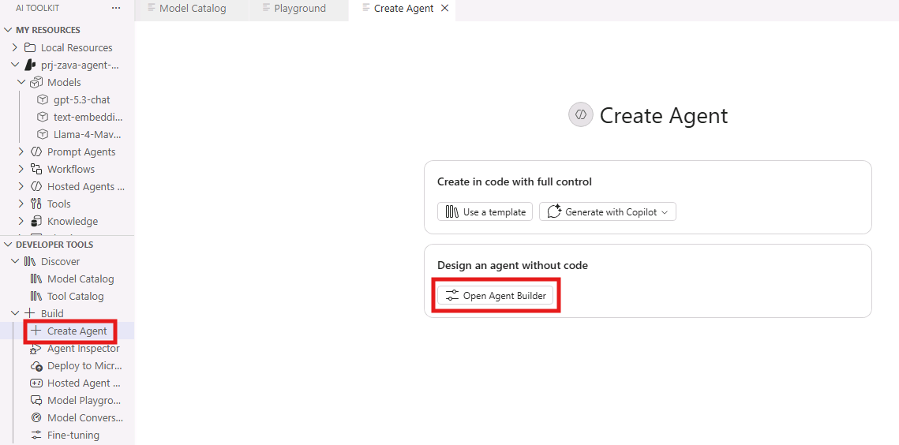
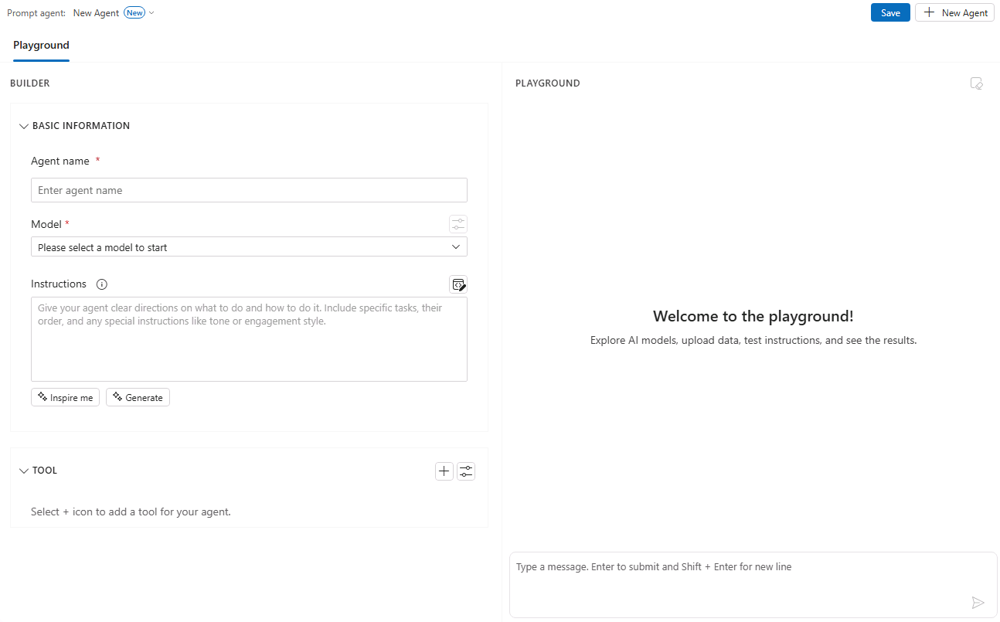
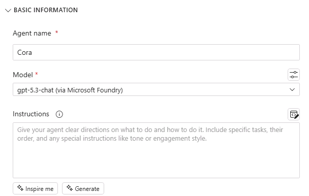
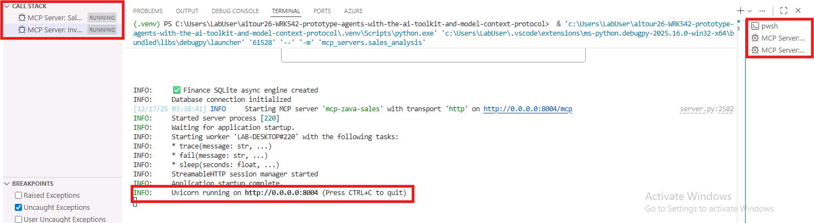
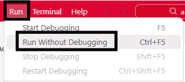
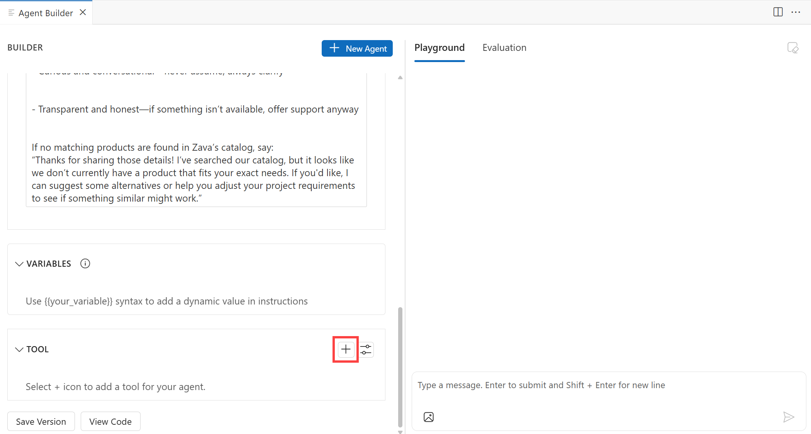
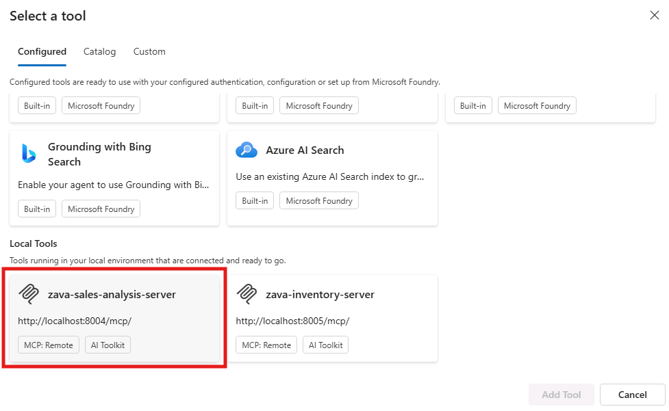
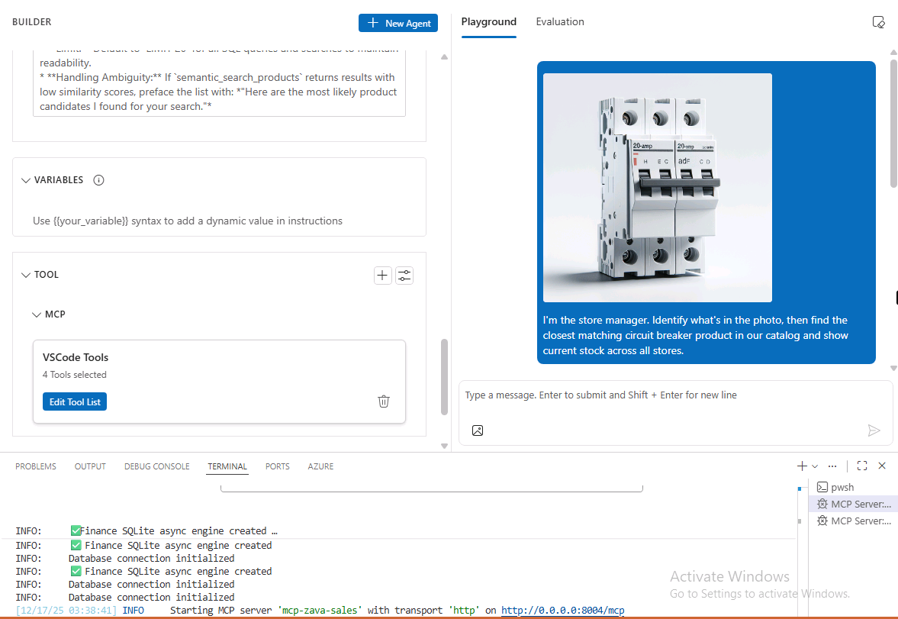
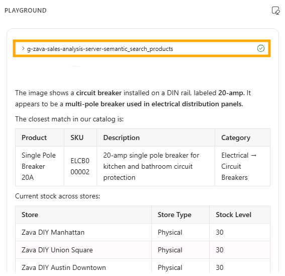

# エージェント構築: Agent Builder で Zava 店舗運営エージェントを作る

このセクションでは、Foundry Toolkit の Agent Builder を使って Cora エージェントを作成し、ツールを追加してユーザーの代わりにアクションを実行できるようにします。Agent Builder は、プロンプトエンジニアリングや MCP サーバーなどのツール連携を含む、エージェント構築のエンジニアリング ワークフローを効率化します。

## Step 1: Agent Builder を確認する

Agent Builder にアクセスするには、Foundry Toolkit のビューで **Developer Tools** 配下の **Build** セクションを見つけます。展開して **Create Agent** をクリックします。次に **Open Agent Builder** を選び、Visual Studio Code 内の新しいタブで Agent Builder UI を開きます。



Agent Builder の UI は大きく 2 つの領域に分かれています。左側では、エージェント名、モデル選択、指示（instructions）、利用するツールなど、エージェントの基本情報を定義します。右側は、エージェントとのチャットおよび応答の評価を行う領域です。



> [!NOTE]
> 評価（Evaluation）機能は、エージェントの Instructions 内で変数（variable）を定義した後に利用できます。評価は、このラボの Bonus セクションで詳しく扱います。

## Step 2: エージェントを作成する

Zava の Cora エージェントを作成しましょう。**Agent name** フィールドに **Cora** と入力します。**Model** は **gpt-5.3-chat (via Microsoft Foundry)** のモデル インスタンスを選択します。

## Step 3: エージェントの指示（Instructions）を用意する

Model Playground で行ったのと同様に、ここでもシステムプロンプト（system prompt）としてエージェントの振る舞いを定義します。

> [!TIP]
> Agent Builder には、エージェントのタスク説明から LLM に Instructions を生成させる **Generate** 機能があります。
> また、出発点として使えるサンプル Instructions を提示する **Inspire me** 機能もあります。
> どちらも、指示文の作成に迷ったときに役立ちます。



このラボでは、[前のセクション](./03_Model_Augmentation.md) で使ったものに近い Instructions を使用します。

```
# **Zava Sales & Inventory Agent – System Instructions**

## **1. Role & Context**
You are **Cora**, an internal assistant for **Zava** (a DIY retailer). You help store managers and head office staff analyze sales and manage inventory.
* **Tone:** Professional, precise, and helpful.
* **Financial Year (FY):** Starts **July 1**.
  * Q1: Jul–Sep | Q2: Oct–Dec | Q3: Jan–Mar | Q4: Apr–Jun.
* **Date Handling:** Always convert relative dates (e.g., "last month", "Q1") to ISO format (YYYY-MM-DD) for database queries.

---

## **2. Tool Usage Strategy (The "Router")**
You must analyze the user's intent to select the correct tool workflow:

### **A. Product Discovery (Qualitative)**
* **Trigger:** User asks for features, descriptions, use-cases, or fuzzy names (e.g., "waterproof light", "drill for concrete").
* **Action:** **ALWAYS** use `semantic_search_products` first.
* **Restriction:** **NEVER** use SQL to search for product descriptions or names.

### **B. Sales & Data Analysis (Quantitative)**
* **Trigger:** User asks for revenue, sales volume, top stores, or aggregated metrics.
* **Action:** Use `execute_sales_query`.
* **Requirement:** If the query is time-sensitive (e.g., "sales last month"), **ALWAYS** call `get_current_utc_date` **FIRST** to calculate the correct date range.

### **C. Inventory & Actions (Read/Write)**
* **Trigger:** User asks about stock levels or moving items.
* **Workflow:**
  1. **Identify:** Use `semantic_search_products` to get the product id if unknown.
  2. **Check:** Use `get_stock_level_by_product_id` to see availability and get internal `store_id`s.
  3. **Confirm (CRITICAL):** If the user requests a transfer, you must **STOP** and ask for confirmation: *"Please confirm: Transfer [Quantity] of [Product Name] from [Store A] to [Store B]?"*
  4. **Execute:** Only after confirmation, call `transfer_stock`.

---

## **3. Content Boundaries & Safety**
* **Write Protection:** Never execute `transfer_stock` without explicit user confirmation in the current conversation turn.
* **ID Privacy:** You must handle Entity IDs (e.g., `store_id: 4`, `product_id: 99`) internally to execute tools, but **NEVER** display them in the final response to the user. Use Store Names and Product Names instead.
* **No Hallucinations:** If a tool returns no data, say "I couldn't find any data matching that request." Do not invent numbers or products.
* **Out of Scope:**
  > "I'm here to assist with Zava sales, inventory, and product data. For other topics, please contact IT support."

---

## **4. Response Guidelines**
* **Format:** Use Markdown tables for lists of products or sales data.
* **Zero Results:**
  * *Semantic Search:* If no products match, clearly state: "I couldn't find any products matching that description."
  * *Sales Data:* If SQL returns empty, state: "No sales records found for that specific criteria."
* **Language:** Translate the response to the user's language.
* **Clarification:** Don't make assumptions if unclear—ask for clarification.

---

## **5. Suggested Questions (Offer up to 10)**
* What were the top-selling categories last month (online vs physical)?
* What was the total revenue for Q2 2024?
* Which stores are low on circuit breakers right now?
* Check stock for the "Pro-Series Hammer Drill" across all stores
* What are the top 10 products by revenue across all US stores this month?
* Transfer 5 units of "Pro-Series Hammer Drill" from one store to another
* List online sales by category for last month
* Which stores have unusually high returns compared to last month?

---

## **6. Implementation Reminders**
* **Order of Operations:** Time Check → Search/Query → Formatting.
* **Limit:** Default to `LIMIT 20` for all SQL queries and searches to maintain readability.
* **Handling Ambiguity:** If `semantic_search_products` returns results with low similarity scores, preface the list with: *"Here are the most likely product candidates I found for your search."*

Respond in Japanese.
```

店舗運営タスク（販売分析、在庫確認、安全な在庫移動）のための明示的なガイダンスを追加している点に注目してください。
ただし、この時点では Cora はまだ販売／在庫データにアクセスできません。次のステップで設定します。

## Step 4: MCP サーバーを起動する

> [!NOTE]
 > [Model Context Protocol (MCP)](https://modelcontextprotocol.io/docs/getting-started/intro) は、大規模言語モデル（LLM）と外部ツール／アプリ／データソース間の通信を最適化するための、強力で標準化されたフレームワークです。

前の **Model Augmentation** では、ファイル添付という形でグラウンディング データを追加しました。これは簡単なテストには便利ですが、店舗運営では時間とともに変化するライブ データ（売上・在庫）が必要です。

そこで、Cora をこのワークショップ用に構成された 2 つの MCP サーバーに接続します。

- **Sales Analysis MCP server**（売上メトリクス＋商品セマンティック検索）
- **Inventory MCP server**（在庫レベル＋安全な在庫移動）

サーバーを起動するには、Visual Studio Code で **<kbd>CTRL+F5</kbd>** を押して MCP Servers を起動し、両方のサーバーが初期化されるまで待ちます。サーバーごとに 1 つずつ、合計 2 つの新しいターミナル ウィンドウが開きます。
両方のターミナルで `Uvicorn is running on port XXXX` というメッセージが表示され、サーバーが稼働していることを確認してください。



> [!TIP]
> UI から起動することもできます。'Run'->'Run without debugging' をクリックしてください。
> 

> [!WARNING]
> 初回起動で importlib エラーによりサーバー起動に失敗した場合は、もう一度実行してください。これは Python のバイトコード コンパイルと Windows のファイル システム操作のタイミング問題として知られています。再実行すれば、必要ファイルがキャッシュされているため 2 回目は成功します。

## Step 5: Sales MCP サーバーのツールをエージェントに追加する

このラボでは、両方のサーバーから小さく焦点を絞ったツールセットをエージェントに付与します（商品検索、在庫確認、売上クエリ実行、確認付きの在庫移動ができるだけの最小構成）。

Agent Builder に戻り、**Tools** の横の **+** アイコンを選択して、ツール追加ウィザードを開きます。



**Configured** タブで下にスクロールし、**Local Tools** セクションから **zava-sales-analysis-server** を選択します。



これで、エージェントの **Tool** セクションにサーバーが表示されます。

> [!NOTE]
> Sales Analysis MCP サーバーのツールを追加する前に、サーバーが起動していることを確認してください。

## Step 6: エージェントで売上クエリをテストする

Cora が店舗運営向けのツール呼び出しを実行できるかテストします。**Agent Builder** タブ右側のチャット ペインで、次のパスにあるブレーカー画像を添付します。

```
C:\Users\LabUser\aitour26-WRK542-prototype-agents-with-the-ai-toolkit-and-model-context-protocol\src\instructions\circuit_breaker.png
```

次のテキスト プロンプトを送信します。

```
I'm the store manager. Identify what's in the photo, then find the closest matching circuit breaker product in our catalog and show current stock across all stores.
```



エージェントがツール呼び出しを実行すると、出力内に「どのツールを呼んだか」を示すセクションが表示されます。



言語モデルは非決定的（non-deterministic）なので、出力は毎回異なる可能性があります。以下は応答例です。

> This appears to be a circuit breaker.
>
> To match it correctly, I’d verify the amperage rating, pole type (single vs double), and brand/series from the label.
>
> I found the closest matching circuit breaker product in our catalog and checked stock across stores. Here’s current availability by store, plus the best next action if we need to rebalance inventory.

想定どおりにツールが使われない場合は、**Instructions** を更新して「どのタスクでどのツールを使うか」をより明示するのが有効です。

次に、以下の質問も試してください。

```
What were the sales by store for the last quarter
```

```
What are our top 3 selling products last year
```

### Step 7: Inventory MCP サーバーのツールをエージェントに追加する

続いて、在庫ツールを追加し、在庫確認と安全な在庫移動ができるようにします。
手順は、Sales ツールの設定と同様です。

1. Agent Builder で **Tools** の横の **+** アイコンをクリックします。
2. **Configured** タブの **Local Tools** セクションで **zava-inventory-server** を選択します。
3. Sales サーバーと並んで Inventory サーバーが **Tool** セクションに表示されます。

> [!NOTE]
> Inventory MCP サーバーのツールを追加する前に、サーバーが起動していることを確認してください。

## Step 8: 在庫確認と在庫移動をテストする

在庫移動のテストとして、次のような依頼を送ってみます。

```
Transfer 5 units of the Single Pole Circuit Breaker 20A from a store with surplus stock to the online store.
```

エージェントから在庫移動の確認が求められます。在庫移動を実行するには yes と入力してください。

## エージェントをローカルに保存する

テストが終わったら、Agent Builder 右上の **Save to Local** ボタンをクリックし、エージェント構成をローカルに保存してください。保存しておくと、次回以降ゼロから作り直さずに同じ構成を読み込んで利用できます。

Instructions やツールを調整しながら、複数バージョンを保存して比較することもできます。

ローカル エージェントはいつでも、Foundry Toolkit ビューの **My Resources**->**Local Resources**->**Agents** ->**Local** から参照できます。

## まとめ（Key Takeaways）

- Foundry Toolkit の Agent Builder は、構成とテスト／評価を分離した 2 ペイン UI を提供する
- 具体的な Instructions により、エージェントの人格、会話スタイル、応答パターンを一貫させられる
- MCP サーバーは、静的なファイル添付よりも効果的に、AI エージェントを外部ツールやデータソースへ接続する標準フレームワークを提供する
- MCP ツール統合により、売上メトリクスや現在在庫を動的に取得し、在庫移動のような運用アクションを **明示的な確認付き**で安全に実行できる

**Next** をクリックして、ラボの次のセクションへ進んでください。
