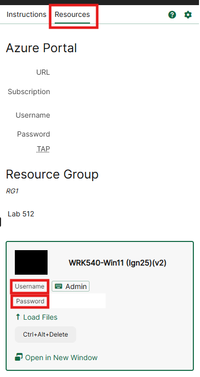
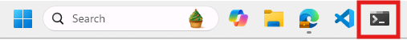
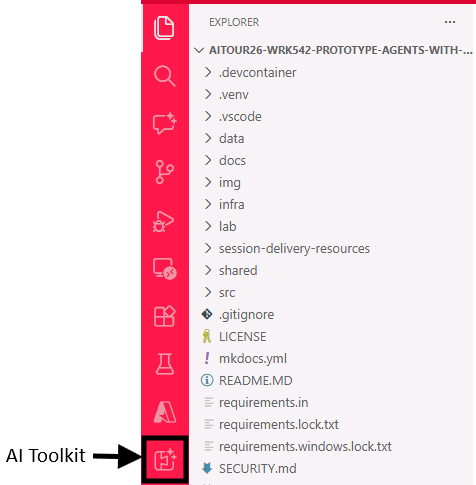
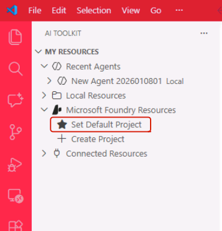
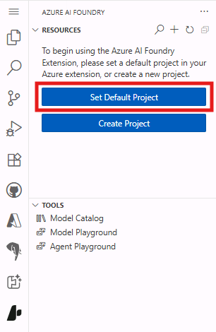
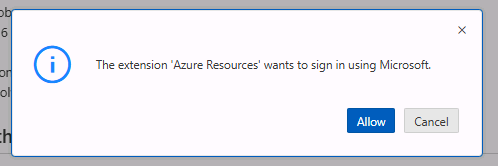
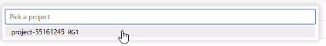

# Get started

> [!TIP]
> **Foundry Toolkit** is the VS Code extension you'll use in this lab to explore models, test prompts, and prototype the agent.

## Sign in to Windows

Log in to the lab Virtual Machine using the credentials in the **Resources tab** under the Skillable VM name.



> [!TIP]
> When you see the "T" icon (for example, +++Admin+++), click it to auto-fill the current field. You can also click any image to enlarge it.

## Open the Workshop Environment in Visual Studio Code

Open the terminal from the taskbar at the bottom of the screen.



Copy and paste the following command block into the terminal and press **Enter**. It updates the workshop repository, activates the Python virtual environment, and opens the project in VS Code.

```powershell
; cd $HOME\aitour26-WRK542-prototype-agents-with-the-ai-toolkit-and-model-context-protocol\ `
; git pull `
; Remove-Item -Recurse -Force .git `
; .\.venv\Scripts\activate `
; $env:OTEL_SDK_DISABLED="true" `
; code .
```

> [!TIP]
> **THEN PRESS THE ENTER KEY**

> [!NOTE]
> You'll get a warning about pasting multiple lines in the terminal. Click on **Paste anyway** to proceed.

## Authenticate to Azure

In your Visual Studio Code instance, you should be able to see the Foundry Toolkit extension already installed. Click on it to open the Foundry Toolkit sidebar.



> [!TIP]
> If you don't see the Foundry Toolkit icon, click on the ellipsis (...) at the bottom of the sidebar to see the full list of installed extensions.

> [!WARNING]
> Auto-update of the VS Code extensions has been disabled to ensure consistency with the lab manual instructions and avoid unexpected issues. Please refrain from updating these extensions during the lab.

Next, click on **Set Default Project** -> **Sign in to Azure**.



<!---->

You'll be prompted with a popup to confirm with the Azure login. Click **Allow**.



Next, you'll be redirected to a window to complete the login process. Enter the following credentials:

-  Email: +++@lab.CloudPortalCredential(User1).Username+++
-  TAP: +++@lab.CloudPortalCredential(User1).TAP+++

> [!NOTE]
> You'll be asked to confirm if you want to allow the automatic sign-in to all desktop apps and websites on the device. Click **Yes** to proceed.

Back in your VS Code instance, you'll be asked to select the Foundry project to use. Select the only available option, which is the project pre-deployed for this workshop.



If the login process was successful, you should now see your project listed under **My resources**. From there, you'll be able to access and manage the project resources, like models, agents and tools.

## Ready to start

That covers the necessary setup to work with the Foundry Toolkit in VS Code and Microsoft Foundry hosted models. We will now move on to the Model Catalog and start interacting with the models.
Click **Next** to proceed to the following section of the lab.
