# Model Selection: Exploring the Foundry Toolkit Model Catalog

In this section, you will explore the Foundry Toolkit Model Catalog to discover, filter, and compare models for your multimodal agent project. The Model Catalog provides access to models from various providers including GitHub, Microsoft Foundry, OpenAI, and others.

## Step 1: Apply Filters to Narrow Your Selection

1. Locate the **Foundry Toolkit** extension icon in the left sidebar
2. Click on the Foundry Toolkit icon to open the extension panel
3. Under **Developer Tools**, expand the **Discover** section and click on **Model Catalog** to open the catalog interface

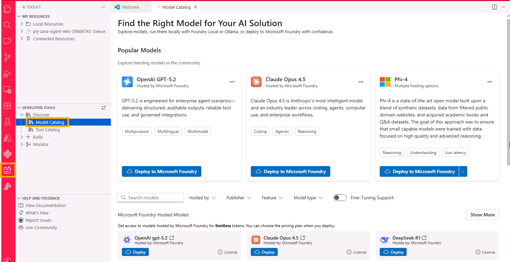

On the top of the page you'll find the most popular models; scroll down to see the full list of available models.

Since the list is quite extensive, you can use the filtering options to narrow down the selection based on your requirements.

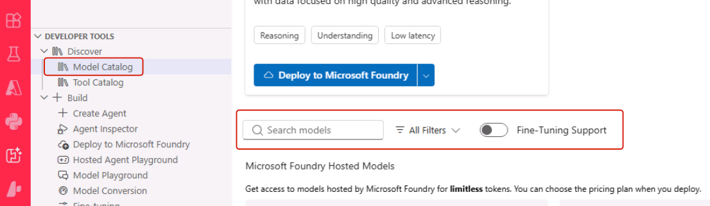

### Filter by Hosting Provider

1. Click **All Filters** and open the `Hosted by` list.
2. Select **Microsoft Foundry**.

### Filter by Publisher

1. Scroll down to **Publisher** and select **Meta**.

### Filter by Model Feature

1. Scroll down to **Feature**.
2. Select **Image Attachment** to find multimodal models that support image input.

## Step 2: Deploy Models to Your Subscription

After applying filters, you'll see a refined list of models.
Locate **Llama-4-Maverick-17B-128E-Instruct-FP8** in the filtered results. It's a multimodal model with good reasoning capabilities.

1. Click **Deploy** on the model tile to open the deployment configuration window.  

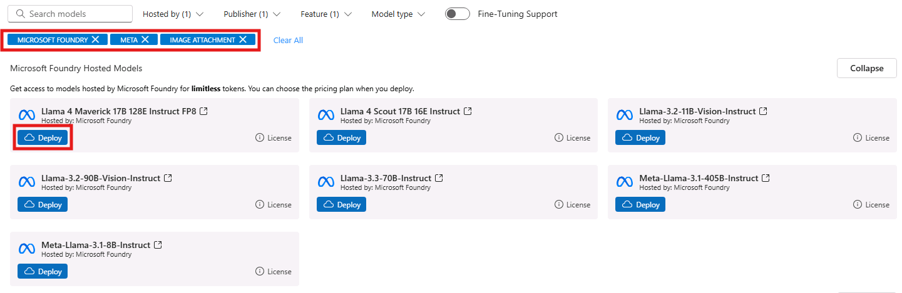

1. Drag the slider of the **Token Per Minute** rate to the right to increase it to approximately 120K. Leave the other parameters as default and click on **Deploy to Microsoft Foundry** to provision an instance of the model to your subscription.

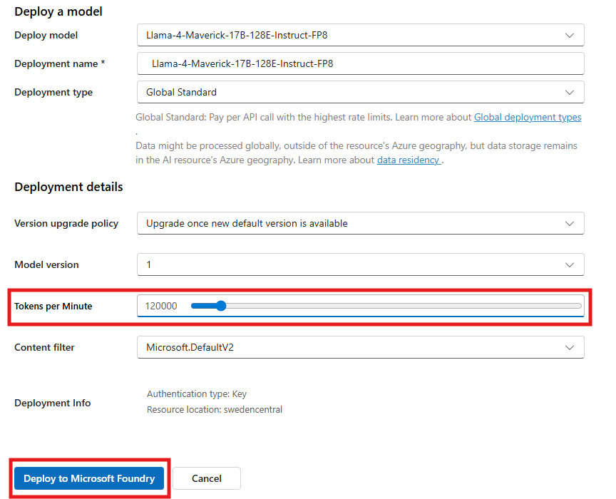

## Step 3: Open the Playground for Testing

1. In the left sidebar, locate the **My Resources** section and expand the resources under your Microsoft Foundry project.
1. Under the **Models** section, you should see the model instance you just deployed. You should also see a pre-deployed instance of **gpt-5.3-chat** for comparison testing later on and an instance of **text-embedding-3-small** that we will use in the next section for vector search and retrieval augmented generation.
1. Right-click on the model instance you just deployed and then select **Open in Playground** from the dropdown menu to start testing the model in the Playground interface.
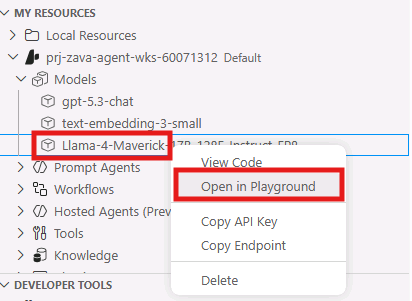

1. In the **Model** field, you'll see the name of the model you just selected.

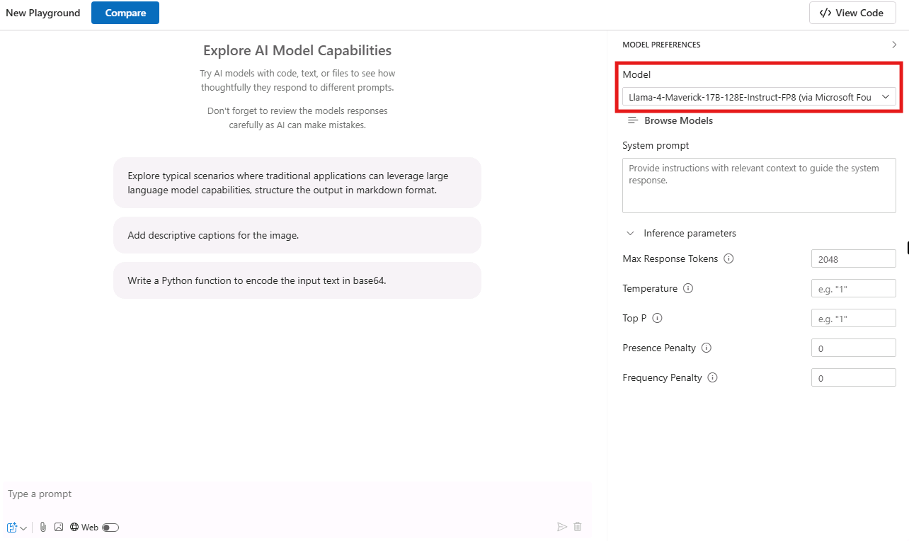

> [!WARNING]
> You might experience some delay in model loading, especially if it's your first time accessing the Playground. Please be patient while the model initializes.

1. Next, click the **Compare** button to enable side-by-side comparison
2. From the dropdown, select **gpt-5.3-chat** deployment that has been pre-deployed for this workshop in Microsoft Foundry
3. You now have two models ready for comparison testing

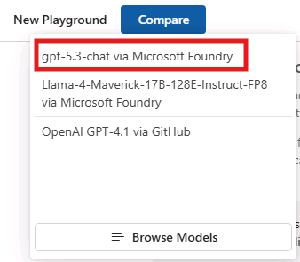

## Step 4: Test Text Generation and Multimodal Capabilities

> [!TIP]
> The side-by-side comparison allows you to see exactly how different models handle the same input, making it easier to choose the best fit for your specific use case.

Let's start interacting with the models with a simple prompt:

1. Enter this prompt in the text field (where you see the placeholder "Type a prompt"):

```
I’m a store manager at a DIY retailer. What are the most important metrics to review in a weekly sales summary, and why?
```

1. Click the paper airplane icon to execute the prompt on both models simultaneously

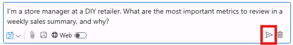

Now let's test their reasoning capabilities, with the following prompt:

```
We have 3 stores (A, B, C). We only have 40 circuit breakers total across all stores and replenishment arrives in 10 days.

Here’s a simple snapshot of sales trend and stock on hand:

| Store | Sales trend (WoW) | Avg weekly units sold | Current stock (units) |
| ----: | ----------------: | --------------------: | --------------------: |
|     A |              +30% |                    18 |                     8 |
|     B |                0% |                    10 |                    22 |
|     C |              -15% |                     7 |                    10 |

How should we allocate stock today to minimize stockouts and lost sales? Explain your reasoning step by step, and list the 3 most important additional data points you would ask for.
```

Next, test the models' image processing capabilities:

1. Enter this prompt in the text field:

```
Describe what's in this image and what kind of electrical component it appears to be.
```

1. Click the image attachment icon to add a picture as input

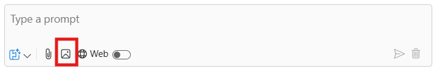

1. You'll be prompted with a browsing window to select the image file attachment to upload. Navigate to the following location:

```
C:\Users\LabUser\aitour26-WRK542-prototype-agents-with-the-ai-toolkit-and-model-context-protocol\src\instructions\circuit_breaker.png
```

Then click **Open**.

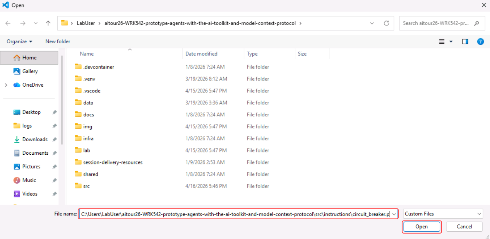

1. Send the multimodal prompt on both models simultaneously.

## Step 5: Analyze and Compare Results

Review the outputs from both models, using several factors to guide your evaluation:

- **Response Quality**: Compare the depth and accuracy of descriptions, as well as the coherence with the input prompt.
- **Detail Level**: Which model provides more comprehensive analysis?
- **Processing Time**: Note any differences in response speed.
- **Output Formatting**: Evaluate clarity and organization of responses, as well as verbosity. Note that the verbosity of the model influences token usage and cost.

## Step 6: Finalize Model Selection

Once we are done with the comparison, we are going to select one of the two models for further prototyping in the next lab sections. For the sake of this exercise, let's go with **gpt-5.3-chat**.

> [!TIP]
> To come back to the standard Playground (with a single pane and a single model), you can click on **Select this model** on the right side of the model name.
>
> 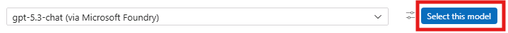

## Key Takeaways

- The Model Catalog provides a comprehensive view of available AI models from multiple providers
- Filtering capabilities help you quickly identify models that match your specific requirements
- Model comparison in the Playground enables data-driven decision making
- Different hosting options offer varying benefits for different stages of development
- Multimodal capabilities can be tested effectively using the built-in comparison tools

This exploration process ensures you select the most appropriate model for your specific use case, balancing factors like performance, cost, features, and deployment requirements.
Click **Next** to proceed to the following section of the lab.
