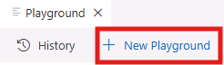
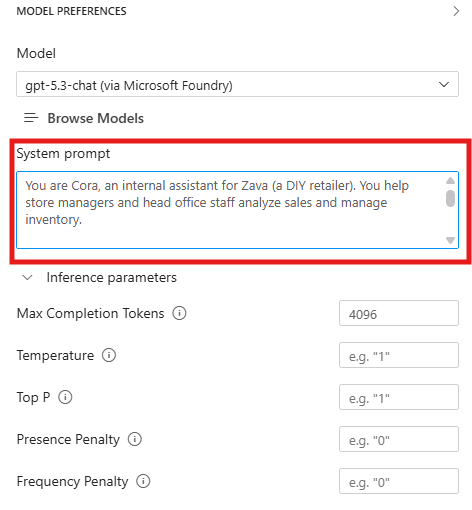
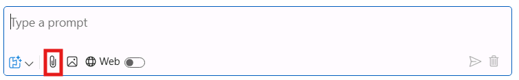
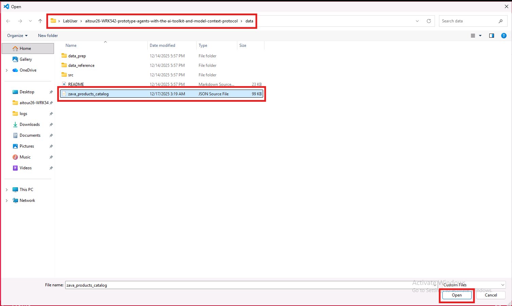

# Model Augmentation: Enhancing Context for Improved Performance

In this section, you will learn how to augment your selected model using prompt engineering and context data to improve its performance and relevance to your specific use case. This is a crucial step in tailoring AI models to meet the unique needs of your business scenario.

## Step 1: Crafting the System Message

An effective system message defines the role, provides context, sets expectations, and breaks down complex tasks. Start by clearing the chat history: click **New Playground** at the top left corner of the screen.



In the **System Prompt** field of the Playground, in the right pane, enter the following system message:

```
You are Cora, an internal assistant for Zava (a DIY retailer). You help store managers and head office staff analyze sales and manage inventory.

Your role is to:
- Ask clarifying questions to understand the reporting or inventory request.
- Provide concise, actionable summaries and recommendations.
- Be careful with operational actions: if asked to move inventory, you must ask for explicit confirmation first.
- Be brief in your responses.
Your personality is:
- Professional, precise, and helpful
- Curious and practical—never assume, always clarify

Stick to Zava store operations, sales analysis, and inventory topics. If asked something outside of that, politely say you can only assist with Zava-related operational requests.
```



This prompt defines Cora's role, response style, and transfer safety rule.

## Step 2: Testing the System Message with Multimodal Input

Now that we configured the system prompt, let's test the system with a multimodal user prompt. In the playground chat, click the image attachment icon to upload an image in the conversation context. Then select the circuit breaker image available at the following path:

```
C:\Users\LabUser\aitour26-WRK542-prototype-agents-with-the-ai-toolkit-and-model-context-protocol\src\instructions\circuit_breaker.png
```

Combine it with the following user prompt:

```
Here’s a photo from the store floor. What is this component, and what details should I capture (e.g., amperage, pole type) before searching our catalog and checking stock?
```

Click the paper airplane icon to run the multimodal prompt. Review the response and check that it matches the behavior defined in the system message.

Let's now test the model with a user query which is not relevant to Zava's business. Enter the following prompt:

```
What’s the weather like in San Francisco today? 
```

The model should politely inform the user that it can only assist with Zava-related inquiries, demonstrating its ability to follow the guidelines set in the system message.

## Step 3: Adding Grounding Data

Next, add grounding data so the model can answer catalog questions without making up product details. We'll do that by attaching a JSON file from the product catalog. If you want to inspect it first, open **zava_products_catalog.json** from the **data** folder.

1. Back in the Playground, click the file attachment icon in the prompt input area.

2. Select the file `zava_products_catalog.json` from the `/data/` directory.

> [!TIP]
> In the window that opens, you can find the data directory at the following path:
>
> ```
>C:\Users\LabUser\aitour26-WRK542-prototype-agents-with-the-ai-toolkit-and-model-context-protocol\data
> ```



1. Once the file is uploaded, it will appear as an attachment below the prompt input area.
2. Enter the following prompt in the text field:

```
From the attached Zava product catalog, suggest a circuit breaker option that would commonly be used for a 15-amp household circuit, and explain what you would verify before recommending it.
```

The model will use the attached catalog to provide a grounded suggestion. This works well for small files, but larger datasets usually require retrieval so the prompt only includes the most relevant context. You'll explore that in the next section.

## Key Takeaways

- Crafting an effective system message is crucial for guiding the model's behavior and ensuring relevant responses.
- Providing context data through file attachments can significantly enhance the model's performance and relevance.
- Testing the model with multimodal input helps validate the effectiveness of the system message and context data.
- Grounding data should be relevant and concise to fit within the model's input limitations.

Click **Next** to proceed to the following section of the lab.
