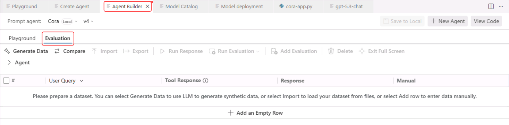
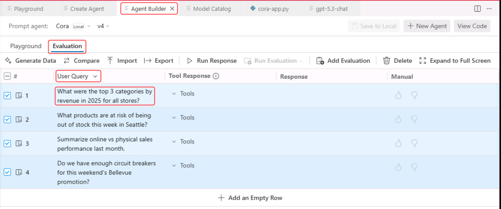
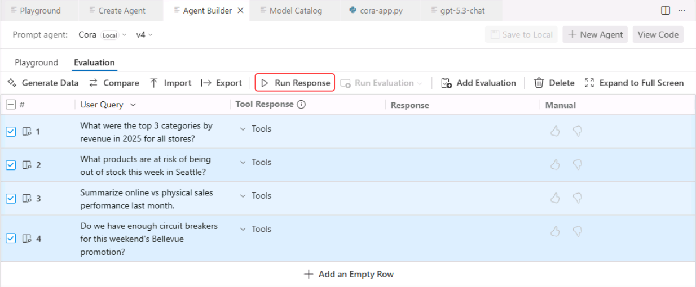
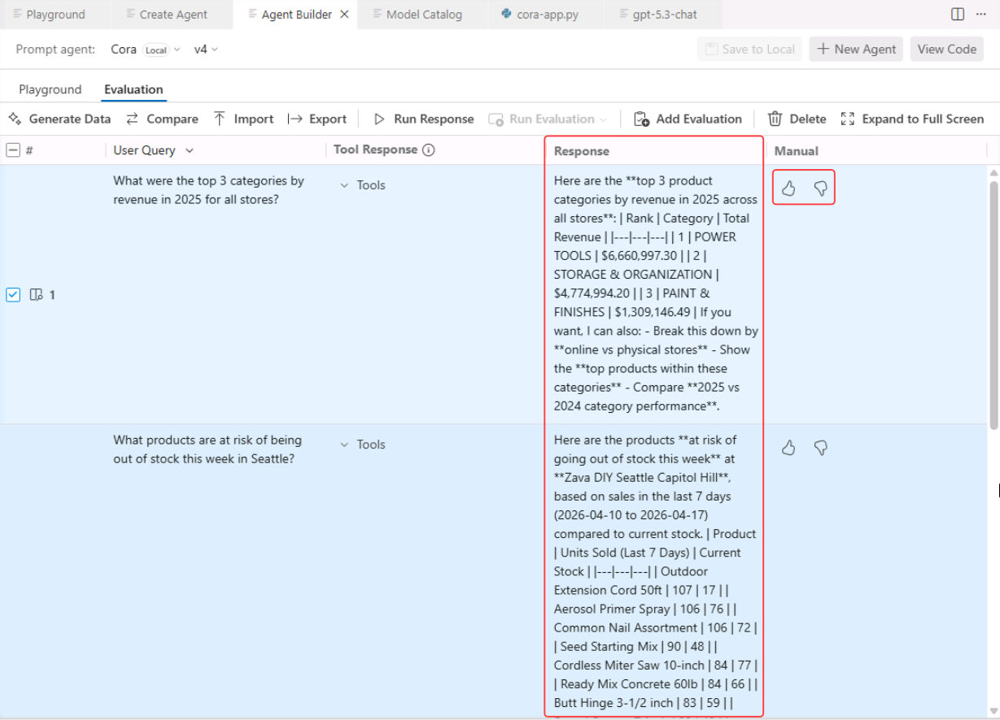
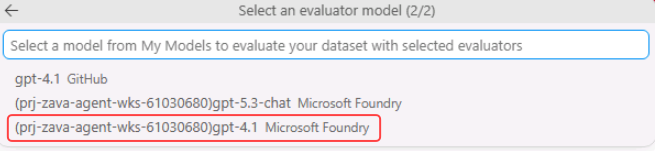
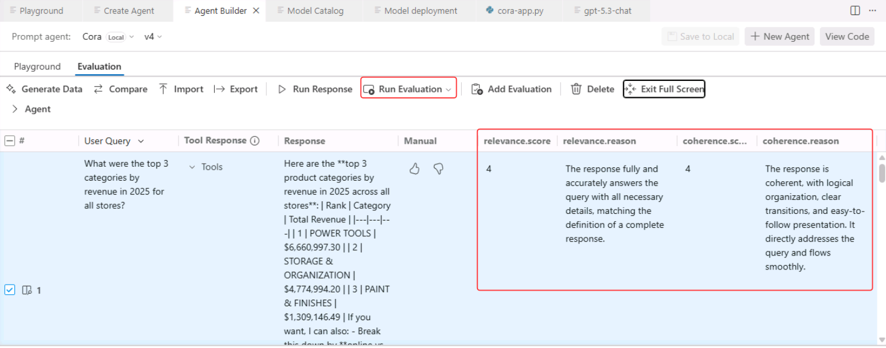

# Evaluate Your Agent Responses

In this section, you will use both manual and AI-assisted evaluation to assess your agent's responses in Agent Builder.

## Step 1: Add Evaluation Data

In Agent Builder, switch to the **Evaluation** tab. Each evaluation row needs a **User Query**.

### Add Data Manually

You can add queries manually in the **Evaluation** tab.

1. Click **Add an Empty Row** four times.
2. Copy and paste the queries from the table below.

    > [!TIP]
    Double-click the **User Query** column in the first row to enter edit mode.

    | User Query |
    | -------------- |
    | `What were the top 3 categories by revenue in 2025 for all stores?` |
    | `What products are at risk of being out of stock this week in Seattle?` |
    | `Summarize online vs physical sales performance last month.` |
    | `Do we have enough circuit breakers for this weekend's Bellevue promotion?` |

When complete, your evaluation panel should look like this:

## Step 2: Assess Your Agent Output

With your dataset prepared, you can run rows individually or in groups. By default, all rows are selected. Select the **Run Response** icon (the play button) to run the selected rows.

The model will generate a response for each **User Query**. Once a response is generated, review the output and select either the **thumbs up** or **thumbs down** icon in the **Manual** column.

Use **thumbs up** if the response meets your expectations: accurate, relevant, clear, and helpful. Use **thumbs down** if it is incorrect, incomplete, confusing, off-topic, or not useful.

Ask yourself: **Did the output do what I needed?** If yes, choose thumbs up; if not, choose thumbs down.

## Step 3: Run an AI-Assisted Evaluation

### Deploy an evaluation model

1. Ensure the Foundry Toolkit extension is selected.
2. Select your Foundry project.
3. In **Models**, click the **+** button.
4. Clear any existing model filters.
5. Search for **gpt-4.1**.
6. Select the model.
7. Increase the **Tokens per minute** slider to approximately 120,000.
8. Select **Deploy to Microsoft Foundry**.

### Enable built-in evaluators

Use built-in evaluators to automatically score your agent's responses.

1. Create a new evaluation by selecting **Add Evaluation**.
2. Select the following evaluators: **relevance** and **coherence**.
3. Select the **gpt-4.1 Microsoft Foundry** model for the evaluator.

    

4. Select **Run Evaluation** → **Run Evaluation Only**.
5. Review the scores for each response.

> [!NOTE]
> The first time you run AI-assisted evaluations, the AI Toolkit will download and install the required dependencies. This may take a moment.

## Key Takeaways

- Manual evaluation helps you verify whether a response is accurate, relevant, and useful.
- AI-assisted evaluation uses built-in evaluators to score responses more consistently and at a larger scale.
