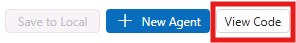
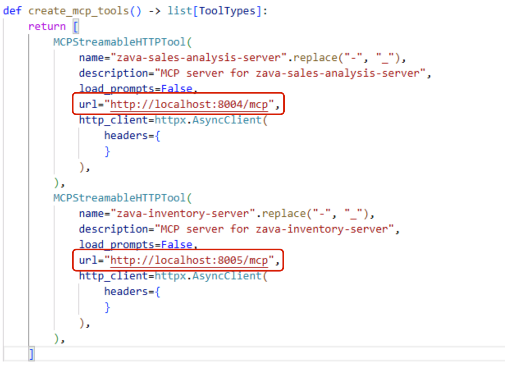

# Bonus: Migrate to Code

> [!Note] This is a bonus section you can complete if you still have time during the allotted lab slot. Otherwise, you can work through it later at your own pace.

In this section, you will learn how to migrate the agent you've created in Foundry Toolkit to a code-based workflow.

Foundry Toolkit can generate code for agents created in Agent Builder. Choose your preferred SDK and language, then integrate the generated file into your app.

## Step 1: Generate the Code

In Agent Builder, click on the **View Code** button at the top right corner of the interface.



> [!Note]
> Make sure you have saved your agent locally, as described in the previous section, otherwise you won't be able to see the **View Code** option.

When prompted, select your preferred client SDK (e.g. *Microsoft Agent Framework*) and programming language (e.g. *Python*). Once the new file is created, save the file to your workspace (under **src/cora-app.py**).

## Step 2: Run the Agent

> [!Note]
> The ***agent-framework*** has been installed in the lab environment.

For example, if you selected the **Microsoft Agent Framework** SDK with **Python**, follow the instructions below:

1. In the cora-app.py file, locate the section where the MCP servers are configured and verify that the URLs and ports match those of your locally running MCP servers.

2. Update the MCP Server URLs, there are two of them, you must remove the trailing `/` so that the format is `http://localhost:PORT_NUMBER/mcp`.

    

3. Open a new terminal in Visual Studio Code by selecting **Terminal** -> **New Terminal** from the top menu.

4. Authenticate to Azure:

    ```
    az login
    ```

    You'll be prompted to open a browser window and fill in a code to complete the authentication. Once back in the terminal, press **Enter** to confirm the Azure subscription selection.

5. Navigate to the directory where the code file is saved:

    ```
    cd src
    ```

6. Run the script using:

    ```
    python cora-app.py
    ```

    > [!Tip]
    > You might want to customize the user inputs to the agent in the script to test out different scenarios and see how the agent performs. Locate the 'USER_INPUTS' array definition in the script and modify the input values as needed. For example:

    ```
    USER_INPUTS = [
        "What are the top 5 best-selling products in the last month?",
        "Which stores have low stock on circuit breakers right now?"
    ]
    ```

> [!NOTE]
> Make sure the MCP servers are running before executing the script. If you followed the previous sections of the lab, the MCP servers should already be running locally on your machine.

## Key Takeaways

- Agent Builder automatically generates code for agents in multiple programming languages and SDKs, facilitating easy migration from prototype to production.
- Code files may contain placeholders that need modification before execution, requiring developers to understand and adapt the generated logic for their specific needs.

Click **Next** to proceed to the following section of the lab.
