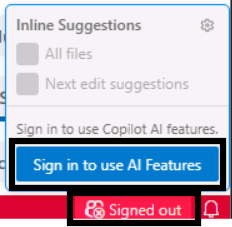
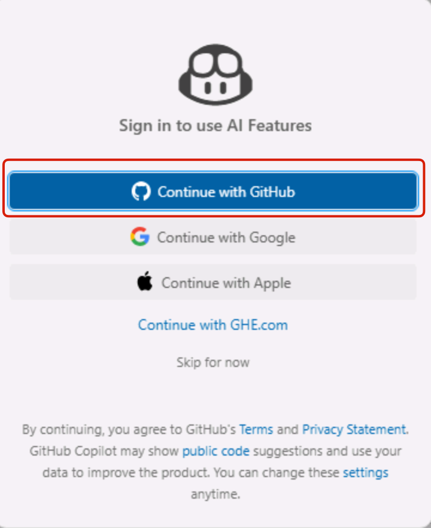
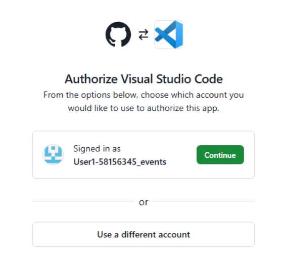
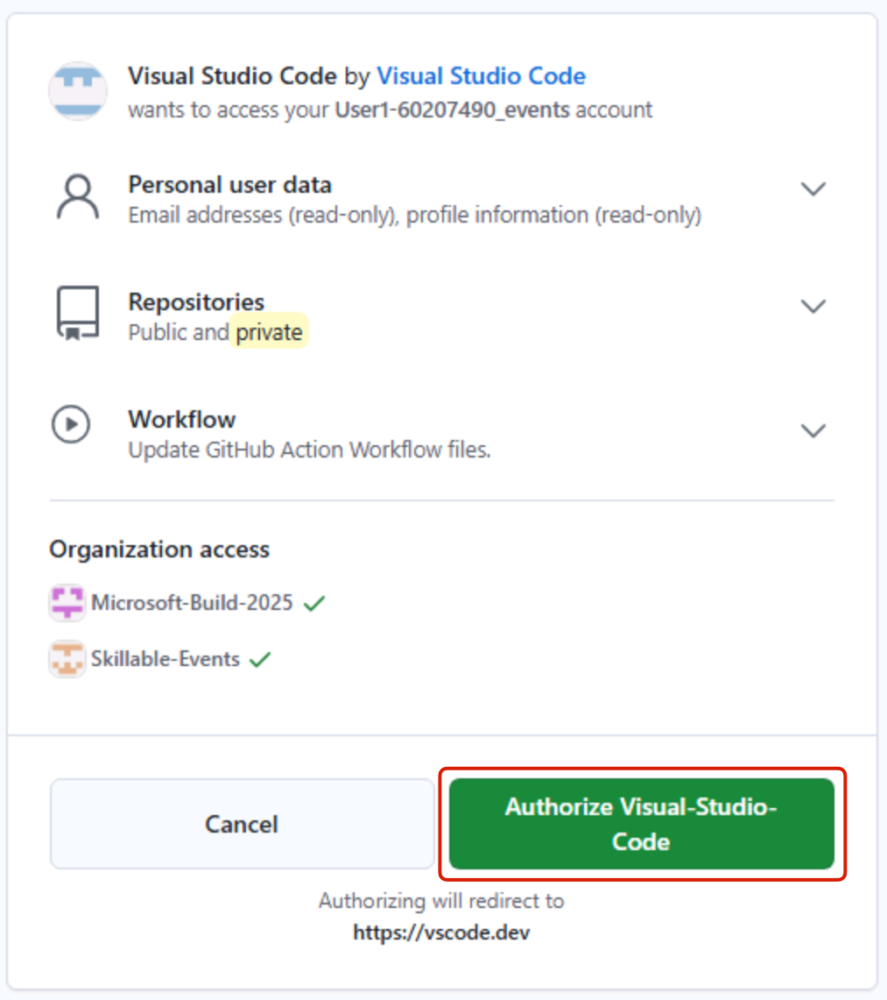
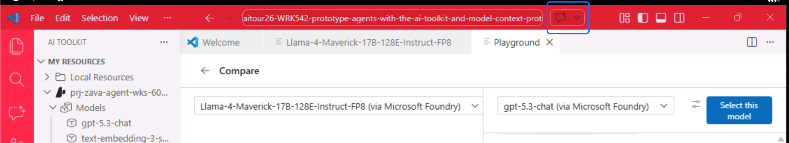
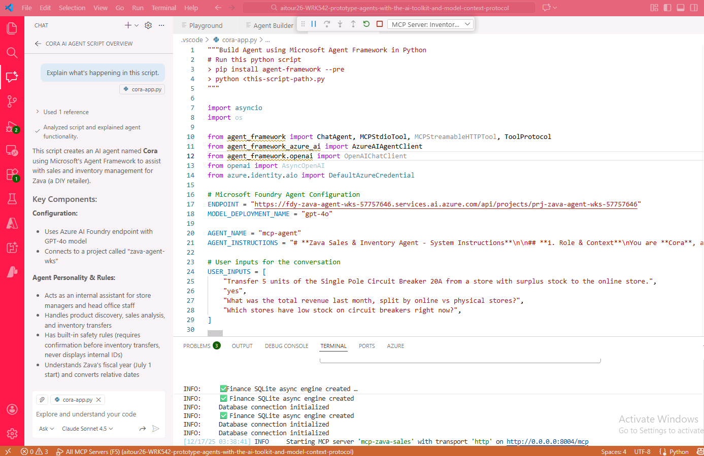
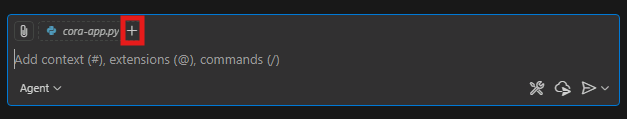

# Bonus: Review Code with GitHub Copilot

In this section, you will use GitHub Copilot Chat in Visual Studio Code to review and understand the agent code you generated in the previous exercise.

## Authenticate with GitHub

1. Open Edge Web Browser, it's pinned to the Windows Task Bar.
2. Select Continue.
3. You'll be prompted to authenticate. Use the following lab credentials:

   - Username: +++@lab.CloudPortalCredential(User1).Username+++
   - TAP: +++@lab.CloudPortalCredential(User1).TAP+++
  
4. Select **Yes** to Stay signed in.

## Enable GitHub Copilot AI Features

1. Click on the **Copilot** icon in the bottom-right corner of the VS Code window, accompanied by the text "Signed out".

1. Click **Sign in to use AI features** -> **Continue with GitHub**.

	

1. Select **Continue with GitHub**.

	

1. A new browser tab will open, prompting you to authorize VS Code. Click **Continue with GitHub** to sign in with the same GHE account you used before.

	

1. In the next window, click **Authorize Visual Studio Code**.

	

1. Select **Open** to return to Visual Studio Code.

Once sign-in is complete, the Copilot status in Visual Studio Code should no longer show as signed out.

## Ask Copilot to Explain the Agent Code

Now that Copilot is enabled, use it to understand the generated agent script.

1. Open **src/cora-app.py** in Visual Studio Code.

	> [!NOTE]
	> If you have not completed the previous section yet, return to **Bonus: Migrate to Code** and generate the agent code before continuing.

1. Select the **Toggle Chat** icon at the top of the Visual Studio Code window to open GitHub Copilot Chat.

	

1. Make sure Copilot Chat is in **Ask** mode.

	

1. Make sure **cora-app.py** is included as context for the chat. If you see a `+` icon beside the file name, click it to add the file as context.

	

1. Ask Copilot Chat to explain the generated script by entering the following prompt:

	```text
	Explain what's happening in this script.
	```

Review Copilot's response and compare it to the code. Pay special attention to how the script connects to the model, configures tools, sends user inputs, and prints the agent responses.

## Key Takeaways

- GitHub Copilot Chat can help you understand generated code before you run or modify it.
- Adding the active file as chat context helps Copilot produce a more accurate explanation.
- Ask mode is useful for learning and review, while Agent mode can help apply code changes after you understand what needs to change.

Click **Next** to proceed to the summary section of the lab.
